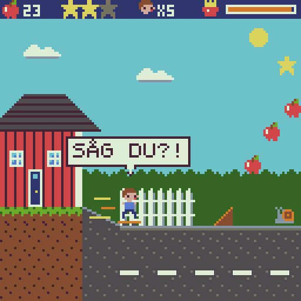

# BO'S SKATEÄVENTYR — designdokument

Status: **utkast för granskning (planering, ingen implementation).** Implementeras enligt PLAN.md Part 3
(M19–M25). Detta dokument och banfilerna (`levels/*.lvl`, skapas från M19) är specifikationen och testernas facit.
Frågorna i §17 har förslag som gäller om inget annat bestäms innan M19 börjar.



*Mockup (§14.6): en skärm ur 1-1 Uppfarten, ritad av den riktiga VM:en i 128 × 128 och uppförstorad 4 ×.
`mockup/mockup.gif` kan skannas med QR Console för att se storleken på Bo och texten på en riktig telefon.*

---

## 0. Spelet på en minut

Bo, 6 år, ger sig ut på skateboard genom fem världar: hemma, skogen, staden, snön och Godislandet. Han samlar
äpplen, pommes och godis, hoppar över eller landar på fiender, grindar räcken och gör tricks. Ett sidscrollande
2D-plattformsspel för barn som också ska vara roligt för vuxna.

Tre saker gör det till **Bos** spel och inte en Mario-kopia:

1. **Skateboarden är rörelsen.** Bo rullar. Fart bevaras, backar ger fart, ramper kastar iväg honom, räcken bär
   honom. Banorna är byggda som skateparker, inte som trappsteg.
2. **Bos röst.** Korta pratbubblor på svenska (`AJ!`, `POMMES!`, `SÅG DU?!`, `JAG GJORDE DET!`).
3. **Bos värld.** Uppfarten, trädgården, lekplatsen, cykelvägen och skateparken. Fienderna är måsar, sniglar och
   igelkottar, inte monster. Ingen dör. Fienderna blir yra och springer hem.

## 1. Låsta designbeslut (förslag)

1. **Bo rullar alltid.** ←/→ pushar, och släpper man knappen rullar han vidare och saktar in långsamt. Det är
   spelets identitet. Det gör också pekskärmen förlåtande: man behöver inte hålla → hela tiden.
2. **Inget våld.** Fiender besegras genom att Bo hoppar över dem, landar på dem eller kör förbi dem med fart. De
   försvinner med ett `POFF` och blir till ett äpple, eller så springer de hem eller somnar. Bossar *vinns*, de dör
   inte: pommesen kommer tillbaka, kaninen får morötter, bulldozern stängs av och måsen blir Bos kompis.
3. **Fart belönas och straffas aldrig blint.** Skärmen är bara 128 px bred. I 3,5 px per bildruta ser man
   0,4 s framåt. Därför har sträckor med hög fart bara faror som syns i god tid (skyltar), eller sådant som klaras
   av sig självt, till exempel ramper som bär över en lucka.
4. **Svårigheten ligger i samlandet, inte i att ta sig fram.** Varje bana ska gå att klara med vanliga hopp.
   Stjärnor och skate-delar kräver tricks, ramper, godis och nyfikenhet.
5. **Allt viktigt visas med bilder.** Skyltar visar knappar och pilar. Äppelbågar visar var hoppen går. Texten
   (svenska versaler med egen stor font med ÅÄÖ, §14.4) är krydda och läsövning. En 6-åring som inte läser än
   ska kunna spela hela spelet.
6. **Få generiska mekaniker med många skins.** Motorn har ett tiotal mark- och objekttyper och nio fiendebeteenden
   (§9). Världarna klär om dem. Varje värld inför högst två nya mekaniker. Det är så spelet ryms i 32 KB.
7. **Omfång:** 5 världar × (4 banor + 1 boss- eller finalbana) = **25 banor**, 4 bossar och 1 storbana. Ingen
   öppen värld, ingen butik, inget inventory, ingen tidsgräns.
8. **Sparning = bildkod.** Fyra bilder visas på kartan i varje ny värld (§7.3). Runtime ändras inte.
9. **Runtime oförändrad** (som i Part 2). Allt spelinnehåll ligger i `games/bo/`.

### 1.1 Tolkningar av idén

Idén lämnade några saker öppna eller motsägelsefulla. Så här löser planen dem (ändra i §17 om något är fel):

| Fråga i idén | Förslag |
|---|---|
| Äpplet är både powerup (Super-Bo) och vanligt samlarobjekt | Samlarobjekt = små äpplen, överallt. Powerup = **STORA ÄPPLET**: dubbelt så stort, glänser och ligger i lådor. Det ger röd hjälm. |
| B = trick, men godiset "ger möjlighet att göra ett trick" | Vanliga tricks (B i luften) finns alltid. Godis ger **GODISSNURREN**: ett magiskt trick som ger ett extra hopp i luften, dubbla trickpoäng och glitter (§5). Godiset handlar då om skicklighet och om att nå höga ställen. |
| ←/→ styr i luften men ska också "rotera" | ←/→ styr. **←/→ + B** gör tricket 360 (Bo snurrar ett varv). Man roterar alltså inte fritt. |
| 4 bossar men 5 världar; Bulldozern kallas "Boss 2" men hör till staden | V1 Stora Måsen, V2 Jättekaninen (en jakt: "hoppar hela tiden efter Bo"), V3 Bulldozern, V4 **Backhoppet** (storbana utan boss, där brädan blir stulen), V5 finalen. |
| Vem tar Bos skateboard, och hur åker Bo i sista världen utan den? | **Stora Måsen** kommer tillbaka och tar brädan efter backhoppet. I Godislandet lånar Bo en **lakritsbräda** av gelégubbarna (samma fysik). Finalen ger tillbaka brädan. |
| Vad är Bos mål mellan bossarna? | Att åka hela vägen till **Godislandet**. En skylt i skateparken visar `GODISLANDET →`, och kartan visar vägen dit. |
| Normala Bo "tål en träff" | Som Mario: normala Bo ramlar av en träff och förlorar ett liv. Äppel-Bo tappar hjälmen och åker vidare. |

## 2. Kontroller

| Knapp | På marken | I luften | På räcke |
|---|---|---|---|
| **←/→** | pusha åt det hållet (accelerera). Motsatt håll = bromsa, sedan vända | styra lite | – |
| **A** | ollie (hopp). Håll A för högre hopp | – (med godis: se B) | hoppa av räcket (ollie) |
| **B** | – | trick: B = KICKFLIP, ↑+B = SHOVE-IT, ↓+B = GRAB, ←/→+B = 360. Med godis: B = GODISSNURR | – |
| **↓** | huka: Bo blir lägre (under bommar och grenar) och bromsar lite. Håll ↓ för att stanna | – | – |
| **↑** | – | används bara tillsammans med B | – |

Webbappens tangenter: pilarna, A = Z/mellanslag/Enter, B = X/Shift. På telefonen: pekkontrollerna (två tummar:
vänster på pilarna, höger på A/B). Eftersom Bo rullar vidare av sig själv behöver man sällan hålla en pil och
trycka två knappar samtidigt.

## 3. Skateboardfysik

### 3.1 Enheter

Positioner och farter i **1/16 pixel**, per bildruta (60 per sekund). En tile = 8 px. Bo är 8 px bred och 16 px
hög inklusive brädan. Han är alltså 2 tiles hög, ungefär som Super Mario på NES-skärmen. Alla värden nedan är
**startvärden**. De ställs in efter Bo-testet (PLAN.md, *Manual acceptance for Part 3*) och samlas i
`games/bo/defs.asm`.

### 3.2 Konstanter

| Namn | Värde | I klartext |
|---|---:|---|
| `G` | 3 | gravitation, 0,19 px/bildruta² |
| `JUMP_V` | 52 | ollie: 3,25 px/bildruta uppåt |
| `JUMP_CUT` | 16 | släpps A på väg upp sänks uppfarten till högst 1 px/bildruta (lågt hopp) |
| `MAX_FALL` | 64 | högsta fallfart, 4 px/bildruta (mindre än en tile per bildruta) |
| `PUSH_ACC` | 1 | push-acceleration per bildruta |
| `PUSH_MAX` | 24 | toppfart med push, 1,5 px/bildruta (≈ 11 tiles/s) |
| `ROLL_FRIC` | 1 per 4 bildrutor | rullmotstånd när man inte pushar |
| `BRAKE` | 3 | broms (↓ eller motsatt pil) |
| `SLOPE_22` | 1 | acceleration nedför 22,5°-backe (lika mycket inbromsning uppför) |
| `SLOPE_45` | 2 | samma för 45° |
| `SPEED_CAP` | 56 | absolut maxfart, 3,5 px/bildruta (nedför, efter tricks) |
| `POMMES_ACC` | 2 | push-acceleration med pommes |
| `POMMES_MAX` | 40 | toppfart med push och pommes, 2,5 px/bildruta |
| `POMMES_CAP` | 64 | maxfart med pommes, 4 px/bildruta |
| `ICE_FRIC` | 0 | is: inget rullmotstånd |
| `ICE_BRAKE` | 1 per 2 bildrutor | is: svag broms |
| `SAND_FRIC` | 1 per bildruta | sand och choklad: trögt |
| `LAUNCH_MAX` | 80 | högsta uppfart från en ramp, 5 px/bildruta |
| `TRICK_BOOST` | 8 | +0,5 px/bildruta per trick vid ren landning (upp till maxfarten) |
| `BOUNCE_V` | 72 | studsmatta och gelé: 4,5 px/bildruta uppåt |

### 3.3 Härledda värden (räknade med motorns ordning: `vy += G; y += vy; x += vx` per bildruta)

Testerna i M19–M20 mäter de här värdena i VM:en och jämför med tabellen.

| Rörelse | Värde |
|---|---|
| Ollie med A nedhållen | **26,6 px högt (3,3 tiles)**, 34 bildrutor i luften (0,57 s) |
| Kort tryck på A | 5,3 px högt, 14 bildrutor |
| Hopplängd vid 1,5 / 2,5 / 3,5 px/bildruta | 6,4 / 10,6 / 14,9 tiles |
| Push 0 → 1,5 px/bildruta | 24 bildrutor (19 px) |
| Push 0 → 2,5 px/bildruta med pommes | 20 bildrutor (26 px) |
| Rulla ut från 1,5 px/bildruta | 96 bildrutor, 74 px (9 tiles) |
| Broms från 1,5 / från 2,5 px/bildruta | 8 bildrutor, 5 px / 14 bildrutor, 15 px |
| Broms på **is** från 2,5 px/bildruta | **80 bildrutor, 100 px (12,5 tiles)**: "svårt att bromsa" |
| Nedför 22,5° / 45° från stillastående till maxfart | 56 bildrutor (100 px) / 28 bildrutor (51 px) |
| Ramp 45° utan ollie, farten vid krönet 1,5 / 2,5 / 3,5 px/bildruta | 5 / 15 / **31 px högt**, 2,8 / 8,1 / **16,2 tiles** långt |
| Ramp 45° **med ollie** vid krönet, farten där 2,5 / 3,5 px/bildruta | 64 px högt (tak), 53 bildrutor, **16,6 / 23,2 tiles**: "jättelångt hopp" |
| Ramp 22,5° med ollie vid krönet, farten där 1,5 / 2,5 px/bildruta | 41 / 52 px högt, 7,9 / 15 tiles |
| Sikt framåt (Bo vid x = 40, 80 px synligt) vid 1,5 / 2,5 / 3,5 px/bildruta | 0,9 / 0,5 / 0,4 s |

### 3.4 Mark och backar

- **Former:** plan, 22,5° (två tiles per steg) och 45° (en tile). Varje form har en höjdkarta på 8 byte. Bos
  fotpunkt (mitten, underkanten) följer höjdkartan, så han glider jämnt upp och ned. Spriten står upprätt.
- **Uppför** bromsar och **nedför** accelererar (`SLOPE_22`/`SLOPE_45`) upp till `SPEED_CAP`. En lång nedförsbacke
  är spelets "turbo".
- **Underlag:** asfalt, gräs och trä är normala. **Sand** och **choklad** är tröga. **Is** har inget rullmotstånd
  och svag broms. **Studsmatta** och **gelé** kastar Bo uppåt med `BOUNCE_V`. Underlaget är en egenskap hos tilen.

### 3.5 Ramper och landning

- **Avfärd:** när Bo lämnar marken vid krönet av en uppförsbacke får han uppfart = farten × lutningen
  (22,5°: hälften, 45°: lika mycket). Trycker man **A vid krönet** läggs en ollie till, upp till `LAUNCH_MAX`.
  Den enda regeln ger både små studsar och jättehopp.
- **Landning på plan mark:** Bo landar mjukt och behåller farten.
- **Landning i en nedförsbacke åt samma håll som han åker:** fallfarten blir fart framåt (vx += vy/4). Det är
  idéns "landa på ramp → boost".
- **Landning mitt i ett trick:** `OJ!`. Bo vinglar, farten halveras och trickpoängen försvinner. Det kostar ingen
  träff.

### 3.6 Räcken (grind)

- Ett räcke är en tunn yta som bara bär uppifrån. Det finns plana räcken och diagonala räcken (ledstänger i trappor).
- Landar Bo ovanpå ett räcke på väg nedåt börjar han **grinda**. Han behöver inte trycka på något. Gnistor syns,
  ett `ssss` hörs och poäng räknas (10 per 8 bildrutor).
- Ingen friktion på plana räcken. Diagonala räcken accelererar som en 45°-backe.
- **A** hoppar av (ollie, och sedan går det att göra tricks). I slutet av räcket fortsätter Bo genom luften med
  samma fart.

### 3.7 Hinder och faror

| Sort | Exempel | Hur |
|---|---|---|
| Fast hinder | mur, stubbe, bil, sten | hoppa över eller upp på |
| Svagt hinder | kartong, snöhög, kexlåda | går sönder om Bo **landar på det** (från ett hopp) eller **kör in i det med pommes** |
| Låda | trälåda med `?`-märke | går sönder när Bo landar på den. Släpper en powerup, äpplen eller en skate-del |
| Lågt hinder | bom, gren, ledstång | huka (↓) och rulla under |
| Grop, bäck, choklad | | Bo ramlar i: ett liv, tillbaka till senaste flaggan (§6) |

## 4. Tricks

| Trick | I luften | Bildrutor | Poäng | Syns som |
|---|---|---:|---:|---|
| OLLIE | (själva hoppet, A) | – | 0 | namnet visas när det ingår i en kombo |
| KICKFLIP | B | 18 | 100 | brädan snurrar runt längden |
| SHOVE-IT | ↑ + B | 14 | 75 | brädan snurrar ett halvt varv platt |
| GRAB | ↓ + B (håll) | 12 eller mer | 50 + 10 per 8 bildrutor | Bo tar tag i brädan |
| 360 | ← eller → + B | 40 | 300 | Bo och brädan snurrar ett helt varv. Kräver ramp |
| GODISSNURR | B med godis (§5) | 24 | 200 | glittrande snurr och ett nytt hopp mitt i luften |
| GRIND | landa på räcke | så länge det varar | 10 per 8 bildrutor | gnistor |

- **Kombo:** alla tricks i samma luftfärd (och en grind direkt före) räknas ihop och multipliceras med antalet
  tricks. Idéns exempel `OLLIE + KICKFLIP = 100` stämmer. `OLLIE + KICKFLIP + SHOVE-IT` = (100 + 75) × 2 = 350.
- Från platt mark hinner man **ett** trick (luftfärd 34 bildrutor). Kombinationer och 360 kräver ramp eller
  räcke. Det blir en naturlig skicklighetstrappa.
- **Ren landning:** poängen läggs till, Bo får `TRICK_BOOST` per trick, och kombonamnet visas ovanför honom i 1 s
  med den lilla inbyggda fonten (`OLLIE + KICKFLIP 100`).
- **Landning mitt i ett trick:** `OJ!` (§3.5).
- **Stor kombo** (3 tricks eller fler, eller minst 500 poäng): `SÅG DU?!`

## 5. Powerups

| Powerup | Var | Effekt | Varar | Syns |
|---|---|---|---|---|
| **STORA ÄPPLET** | lådor | Bo tål en träff till | tills Bo blir träffad (följer med mellan banor) | röd hjälm, hjälm på HUD-huvudet |
| **POMMES** | lådor, kiosker | push-toppfart 2,5 i stället för 1,5 px/bildruta, dubbel acceleration, maxfart 4 px/bildruta. Kör sönder svaga hinder och knuffar bort fiender som han krockar med framifrån | 10 s (600 bildrutor) | `POMMES POWER!`, fartspår, orange timerstapel, egen snabb musik |
| **GODIS** | lådor, godispåsar | B i luften = GODISSNURR: ett extra hopp (`JUMP_V`) **en gång per luftfärd**, glitter, Bo är oskadlig under snurren, alla trickpoäng × 2 | 15 s (900 bildrutor) | glitter, rosa timerstapel |

- Pommes och godis gäller inte samtidigt. Den senaste ersätter den förra. Hjälmen gäller tillsammans med båda.
- **Måsen och pommesen:** krockar Bo med en mås medan pommes är igång tar måsen pommesen: `NEJ! MINA POMMES!`.
  Pommes-effekten tar slut, men Bo blir inte skadad. Det är idéns "försöker ta Bos pommes", och måsar blir ett
  hot man ser komma.
- Pommes gör alla hopp längre, eftersom farten är högre. Hoppen blir inte högre.

## 6. Träffar, liv och flaggor

- **Normala Bo** som blir träffad: `AJ!`. Han ramlar av brädan, förlorar ett liv och börjar om vid senaste flaggan.
- **Äppel-Bo** som blir träffad: hjälmen flyger av (`AJ!`), och han blinkar och är oskadlig i 2 s (120 bildrutor).
- **Gropar, vatten och choklad** kostar alltid ett liv, även med hjälm. Regeln är enkel och tydlig.
- **Liv:** 5 från början, +1 per 100 äpplen, högst 9 (en siffra på HUD:en).
- **Game over:** `FÖRSÖK IGEN!` Banan börjar om från början med 5 liv. Inget annat går förlorat (äpplen,
  stjärnor och delar finns kvar).
- **Flaggor:** 1–3 per bana, ungefär var 45:e–60:e sekund. Äpplen, stjärnor och trasiga lådor stannar som de var
  efter ett fall. Fiender kommer tillbaka.

## 7. Samlarobjekt, brädor och sparning

### 7.1 Samlarobjekt

| Objekt | Antal | Funktion |
|---|---|---|
| 🍎 **Äpple** | 60–100 per bana | 100 = extra liv. Ligger i rader och **bågar som visar hoppbanan** |
| ⭐ **Stjärna** | 3 per vanlig bana (60 totalt) | ★1 på vägen men lite klurig. ★2 kräver trick, ramp eller godis. ★3 ligger på en hemlig väg (`KOLLA!`) |
| 🛹 **Skate-del** | 1 per vanlig bana, 4 per värld | hjul, truckar, bräddesign och klistermärke. Alla fyra i en värld = världens bräda |

### 7.2 Brädor

| Bräda | Hur | Utseende (förslag) |
|---|---|---|
| Bos bräda | från början | orange (tas av måsen i V4 och kommer tillbaka i finalen) |
| Hemmabrädan, Skogsbrädan, Stadsbrädan, Isbrädan, Godisbrädan | världens fyra skate-delar | grön med hus, träådring, graffiti, isblå, rosa randig |
| Lakritsbrädan | lånas i V5 | svart |
| **Guldbrädan** | alla 60 stjärnor | guld |

Brädor är **bara utseende** (förslag, §17). Brädan ritas med `RECTFILL` med färg ur en tabell, så nya brädor
kostar några byte. Man väljer bräda med B på kartan.

### 7.3 Bildkod (sparning)

QR Console sparar inget mellan gångerna (VM:en börjar alltid från noll). Därför visar kartan i varje ny värld
en **kod med fyra bilder** ur spelets egna sprites (16 sorter: äpple, stora äpplet, pommes, godis, stjärna, hjul,
truck, klistermärke, snigel, mås, igelkott, geting, boll, nalle, blobb, Bo). 4 × 4 bitar = 16 bitar:

```
värld (3) + brädor upplåsta (5) + världar med alla 12 stjärnor (5) + kontrollsumma (3)
```

Koden skrivs in från titelskärmen med B: ↑/↓ byter bild, ←/→ flyttar och A bekräftar. Fel kod ger `FEL KOD`.
En förälder kan ta en skärmbild av koden. Stjärnor i en värld som inte är helt klar sparas inte.

## 8. Världar och banor

### 8.1 Regler för banorna

- **Längd** 150–300 kolumner (ungefär 1–2,5 minuter för ett barn). **Höjd** 16 rader (en skärm) eller 32 rader
  (två skärmar, med vertikal kamera).
- **En ny sak per bana.** Den visas först där den är ofarlig, sedan övar man på den, sedan prövas den, och till
  sist kommer en twist.
- **Skyltar med bilder** (A-knapp, B-knapp, pil eller ↓) där något nytt börjar. **Äppelbågar** visar hopp.
- **Höga farter** bara på flytsträckor (§1, punkt 3).
- **Mål:** en flagga. Bo bromsar in och säger `JAG GJORDE DET!`, och sedan visas räkningen (äpplen, stjärnor,
  poäng, del).

### 8.2 De 25 banorna

| Bana | Namn | Nytt | Fiender och inslag |
|---|---|---|---|
| **Värld 1** | **HEMMA** | *Solig villagata: röda hus med vita knutar, gröna gräsmattor, grå asfalt* | |
| 1-1 | UPPFARTEN | rulla, pusha, bromsa, ollie, landa på en låda (STORA ÄPPLET) | snigel. Skate-del bakom garaget |
| 1-2 | TRÄDGÅRDEN | 22,5°-backar (gräsmatta), första B-tricket, studsmatta | igelkott (går inte att landa på), getingar vid äppelträdet |
| 1-3 | LEKPLATSEN | envägsplattformar (klätterställning), rutschkana = 45°-backe, sandlåda (trög) | studsande bollar, nallar |
| 1-4 | CYKELVÄGEN | **pommes** från en kiosk, lång snabb sträcka med kickers, svaga hinder, första gropar | måsar som tar pommes |
| 1-5 | SKATEPARKEN | **BOSS: Stora Måsen** (§10.1) | |
| **Värld 2** | **SKOGEN** | *Gröna toner och bruna stammar. Stora höjdskillnader, ramper, långa hopp* | |
| 2-1 | SKOGSSTIGEN | kullar, rötter, stubbar som plattformar, **godis** (en övergiven picknickkorg) | getingar, ekorrar som kastar kottar (förslag) |
| 2-2 | BÄCKEN | vatten (fara), träbroar, stenar, ramper över bäckar | sniglar, igelkottar |
| 2-3 | STORA BACKEN | idéns bana: skogsstig → nedförsbacke → mer och mer fart → stor ramp → **jättelångt hopp** (32 rader hög) | stjärna mitt i hoppet |
| 2-4 | FLOTTLEDEN | **rörliga plattformar** (stockar som flyter) | getingar |
| 2-5 | KANINJAKTEN | **BOSS: Jättekaninen** jagar Bo genom skogen (§10.2) | |
| **Värld 3** | **STADEN** | *Grå trottoarer, tegel och gula bussar. Här blir skateboarden riktigt viktig* | |
| 3-1 | TROTTOAREN | **grind** (låga räcken, bänkar), kantstenar, parkerade bilar som plattformar | duvor (förslag), måsar |
| 3-2 | TRAPPORNA | **diagonala räcken** (ledstänger), våningar | måsar |
| 3-3 | BUSSEN | åk på **bussens tak** (rörlig plattform) genom gatan, parkeringsplats | duvor |
| 3-4 | TORGET | trickbana: räcke → grind → hopp → landa på ramp → boost, 360 | studsande bollar |
| 3-5 | BYGGARBETSPLATSEN | **BOSS: Bulldozern** (§10.3) | |
| **Värld 4** | **SNÖ** | *Vitt, ljusblått och mörkblått. Snö är normalt underlag, men is är halt* | |
| 4-1 | SNÖGATAN | **is** (svårt att bromsa), snöhögar (svaga hinder) | snögubbar som kastar snöbollar |
| 4-2 | PULKABACKEN | lång nedförsbacke, hopp | pulkor som glider nedför |
| 4-3 | ISSJÖN | långa isytor, vakar (vatten), precision trots halka | snögubbar |
| 4-4 | LIFTEN | skidliftens stolar som rörliga plattformar uppför berget (32 rader hög) | snöbollar |
| 4-5 | BACKHOPPET | **storbana**: hoppbacken, det längsta hoppet i spelet, sedan stölden (§10.4) | |
| **Värld 5** | **GODISLANDET** | *Rosa, gult och brunt. Godis överallt, och godisfienderna vill äta Bo* | |
| 5-1 | KLUBBSKOGEN | klubbor som plattformar, lakritsbrädan lånas | gelégubbar (studs när man landar på dem) |
| 5-2 | CHOKLADFLODEN | choklad (fara), marshmallowflottar (rörliga), popcornkanoner | godisblobbar |
| 5-3 | LAKRITSFABRIKEN | lakritsräcken överallt, långa grindkombos | popcornkanoner, gelégubbar |
| 5-4 | TÅRTBERGET | vertikal klättring (32 rader), sista chansen för stjärnor | godisblobbar |
| 5-5 | MÅSENS BO | **FINAL: Den stora skateboardstölden** (§10.5) | |

### 8.3 Exempel: 1-1 Uppfarten i grova drag

Teckenförklaring: `S` snigel, `T` soptunna, `?` låda, `F` flagga, `o` äpple, `*` stjärna, `>` och `A` skyltar.

```
Första halvan: rulla, hoppa, landa på saker

                                         *1 på skjulets tak
                                            (upp via soptunnan)
 [HUS]                                    [SKJUL]
      \____>______S______?______A___T______________F
   uppfart  skylt   snigel  låda med  A-skylt        flagga
   22,5°    "rulla"         STORA     + soptunna
                            ÄPPLET

Andra halvan: ramp + A, gratis fart i backar

                o   o   o  *2                 *3 och HJULET: en hemlig väg
             o                                   bakom garaget ("KOLLA!")
            /|                /--\                          [GARAGE]
 F_________/_|_______________/    \______S____S_____________________ MÅL
         kicker (A vid krönet)    kulle   två sniglar: hoppa över
                                          eller landa på
```

## 9. Fiender

Motorn har **nio beteenden**. Varje fiende är ett beteende plus sprites och parametrar i en tabell.

| Beteende | Rörelse |
|---|---|
| GÅR | går fram och tillbaka och vänder vid väggar och kanter |
| STUDSAR | hoppar i bågar, ibland mot Bo |
| FLYGER | följer en bana (cirkel, upp-ned, åtta) |
| DYKER | svävar högt, varnar och dyker mot platsen där Bo var |
| KASTAR | står still och kastar projektiler i bågar |
| PROJEKTIL | kotte, snöboll, popcorn: en båge med gravitation |
| RULLAR | glider nedför backar (pulka, snöboll) |
| FÖLJER | följer Bo med fördröjning (kaninen, bulldozern) |
| PLATTFORM | rör sig längs en bana och bär Bo (stock, buss, liftstol, marshmallow) |

| Fiende | Värld | Beteende | Landa på den | Krock med pommes | Annars |
|---|---|---|---|---|---|
| Snigel | 1, 2 | GÅR, långsam | `POFF`, blir ett äpple | knuffas bort | träff |
| Mås | 1, 3 | DYKER | studsar iväg | **tar pommesen** | träff |
| Igelkott | 1, 2 | GÅR, taggig | **träff** (hoppa över!) | träff | träff |
| Geting | 1, 2 | FLYGER, små mönster | `POFF` | knuffas bort | träff |
| Bollmonster | 1, 3 | STUDSAR | plattas till, Bo studsar högt | knuffas bort | träff |
| Nalle | 1 | GÅR | somnar (`ZZZ`) | knuffas bort | träff |
| Ekorre *(förslag)* | 2 | KASTAR kottar | `POFF` | – | kotten = träff |
| Duva *(förslag)* | 3 | GÅR, flyger upp när Bo kommer | `POFF` | knuffas bort | träff |
| Snögubbe | 4 | KASTAR snöbollar | rasar ihop | rasar ihop | träff |
| Pulka | 4 | RULLAR | – (hoppa över) | – | träff |
| Gelégubbe | 5 | GÅR, studsig | Bo studsar extra högt (`BOUNCE_V`) | knuffas bort | träff |
| Godisblobb | 5 | STUDSAR mot Bo, "vill äta Bo" | `SPLAT`, blir en godisbit | knuffas bort | träff |
| Popcornkanon | 5 | KASTAR popcorn | – | – | popcorn = träff |

Under GODISSNURREN är Bo oskadlig, och fiender han rör studsar iväg. Fiender spawnas när kameran närmar sig och
kommer tillbaka efter ett fall (§6).

## 10. Bossar och storbanan

Gemensamt: varje boss har ett **tydligt mönster som upprepas**, varningar före varje attack (ljud och blinkning),
tre "träffar" för att vinna, och mönstret blir lite snabbare efter varje träff. Ingen boss skadas. Den ger upp,
somnar eller blir vän.

### 10.1 Stora Måsen (1-5 Skateparken)

- **Före:** i introt sitter Bo på trappan med pommes. Stora Måsen dyker ned och tar dem: `NEJ! MINA POMMES!`.
  Under värld 1 syns måsen flyga iväg i slutet av varje bana.
- **Arena:** en skärm bred skatepark med en 45°-ramp i varje ände, en bänk och en lyktstolpe.
- **Mönster:** (1) måsen flyger fram och tillbaka högt upp. (2) `SKRIII!` och blinkning i 1 s. (3) den dyker
  snett mot platsen där Bo *var*. Man undviker den genom att åka därifrån eller huka. (4) den landar och är yr
  i 2 s. Då landar Bo på den: den tappar en pommesask och flyger upp igen.
- **Vinst:** efter 3 gånger tappar den hela påsen: `MINA POMMES!` → `POMMES POWER!` → `JAG GJORDE DET!`
- **Lär ut:** varningar, huka, ramphopp och att landa på saker.

### 10.2 Jättekaninen (2-5 Kaninjakten)

- **En jaktbana** (≈ 200 kolumner), inte en arena. Kaninen dyker upp bakom Bo och hoppar efter honom i stora
  bågar, i snitt lite långsammare än Bos toppfart. Varje landning skakar marken: står Bo på marken just då
  vinglar han och tappar fart (ingen träff).
- Hinner kaninen ifatt Bo är det en träff, och jakten börjar om från flaggan med kaninen längre bak.
- **Vinst:** sista rampen tar Bo över en bred bäck. Kaninen stannar vid kanten, nosar, hittar ett morotsland och
  börjar äta: `DEN VILLE BARA HA MORÖTTER!`
- **Lär ut:** att hålla farten och att inte stanna.

### 10.3 Bulldozern (3-5 Byggarbetsplatsen)

- En **förarlös bulldozer** har rymt och kör långsamt mot Bo. Den knuffar lådor framför sig. På taket sitter en
  stor röd **STOPP-knapp**.
- **Arena:** byggställningar (envägsplattformar), ramper, ett rör som räcke och en kranarm.
- **Tre faser:** (1) hoppa från en ramp och landa på knappen. Bulldozern backar. (2) skopan höjs och skyddar
  framsidan, så man måste upp på ställningen och hoppa därifrån. (3) den tappar sandhögar. Grinda kranarmen och gör
  ett trick ned på knappen.
- **Vinst:** bulldozern stannar för gott. Bo säger `DEN ÄR AVSTÄNGD!`
- **Lär ut:** idéns "ramper och skateboardtricks för att ta sig förbi".

### 10.4 Backhoppet (4-5): storbanan och stölden

- En lång nedförsbacke i snö och is (32 rader hög) där farten byggs upp till max, och sedan en jättelik hoppbacke.
  Luftfärden blir över 2 s: tid för en hel kombo. De tre stjärnorna sitter längs olika hoppbågar.
- **Stölden (mellanscen):** Bo landar och jublar `JAG GJORDE DET!`. Då dyker Stora Måsen ned och tar brädan:
  `SKRIII!`, `NEJ! MIN BRÄDA!`. Måsen flyger mot den rosa horisonten, alltså Godislandet.

### 10.5 Finalen: Den stora skateboardstölden (5-5 Måsens bo)

- Bo åker på den lånade lakritsbrädan. Hela värld 5 är jakten: i slutet av varje bana syns måsen med brädan.
- **Arena:** toppen av Godisslottet med måsens bo av godis, lakritsräcken och ramper.
- **Tre faser** med allt Bo har lärt sig: (1) som Stora Måsen men måsen släpper popcorn. (2) måsen flyger högre,
  så det krävs ramp + ollie för att nå. (3) grinda lakritsräcket till boet och gör ett trick för att ta brädan.
- **Slut:** `MIN BRÄDA!` Måsen ser ledsen och hungrig ut. Bo: `VILL DU HA POMMES?` Måsen äter glatt, och det
  visar sig att den bara var hungrig. Sluttexterna rullar medan Bo åker hem genom alla fem världarna. Sist:
  `JAG GJORDE DET!` och statistik (stjärnor x/60, äpplen, poäng). Med alla 60 stjärnor visas Guldbrädan.

## 11. Berättelse och mellanscener

Bilder och korta repliker. Inga långa texter. Talaren visas med en liten ansiktsbild.

| Scen | Repliker |
|---|---|
| Intro | (Bo med pommes) · måsen: `SKRIII!` · Bo: `NEJ! MINA POMMES!` · `VÄNTA, MÅSEN!` |
| Efter 1-5 | `MINA POMMES!` · `MUMS!` · (skylt `GODISLANDET →`) · `JAG SKA TILL GODISLANDET!` |
| Efter 2-5 | `DEN VILLE BARA HA MORÖTTER!` |
| Efter 3-5 | `DEN ÄR AVSTÄNGD!` |
| Efter 4-5 | `JAG GJORDE DET!` · måsen: `SKRIII!` · Bo: `NEJ! MIN BRÄDA!` |
| Före 5-1 | gelégubbe: `LÅNA MIN!` · Bo: `EN LAKRITSBRÄDA!` |
| Efter 5-5 | `MIN BRÄDA!` · `VILL DU HA POMMES?` · måsen: `SKRII!` · `SLUT` |

## 12. Bos repliker

Bubblorna visas ovanför Bo i 1,5 s, högst en i taget, med 3 s paus för repliker som kan komma ofta.

| Händelse | Replik |
|---|---|
| träff, eller ramlar | `AJ!` |
| landar mitt i ett trick | `OJ!` |
| tar pommes | `POMMES!` (och `POMMES POWER!` som stor banner) |
| en mås tar pommesen | `NEJ! MINA POMMES!` |
| tar godis | `GODIS!` |
| tar stora äpplet | `HJÄLMEN PÅ!` |
| hittar en hemlig väg | `KOLLA!` |
| stor kombo | `SÅG DU?!` |
| första grinden på en bana | `WIII!` |
| tar en stjärna | `EN STJÄRNA!` |
| tar en skate-del | `ETT HJUL!` · `TRUCKAR!` · `EN DESIGN!` · `ETT MÄRKE!` |
| 100 äpplen | `ETT LIV TILL!` |
| bana klar | `JAG GJORDE DET!` |
| ny bräda | `EN NY BRÄDA!` |
| game over | `FÖRSÖK IGEN!` |

*Valfritt:* Bo "pratar" med korta pip, ett per stavelse, på en fyrkantskanal (som i Animal Crossing).

## 13. Skärm, HUD och flöde

```
y 0–7     HUD   🍎 23   ★★☆   [Bo]×5   [🍟]▓▓▓▓░░        (se mockupen)
y 8–127   spelplan: 16 × 15 tiles. Vid scroll ritas 17 kolumner. Vid vertikal scroll ritas 16 rader.
```

- **Kameran:** när Bo åker åt höger hålls han vid x ≈ 40, så att 80 px framåt syns (spegelvänt åt vänster).
  Står han still centreras han. Vertikalt följer kameran med en dödzon. Ingen skakning, utom när kaninen landar.
- **Flöde:** titel (`BO'S SKATEÄVENTYR`, A = spela, B = kod) → intro → världskarta (5 platser på en väg,
  stjärnor och delar per bana, bildkoden, B = välj bräda) → titelkort (`1-1 UPPFARTEN`, 1 s) → bana → räkning →
  karta. Efter en boss kommer en mellanscen och sedan nästa världs karta.
- Man kan spela om klarade banor på kartan för att samla det man missade.

## 14. Teknik

### 14.1 Banor: format och RAM

- **Källa:** en textfil per bana, `games/bo/levels/1-1.lvl`, med huvud, terrängprofil och objektlista. Exakt
  syntax bestäms i M19. Generatorn `games/bo/tools/levels.ts` skriver `levels.gen.asm` och en förhandsbild
  `levels/1-1.png`, så att banorna kan granskas utan att spelas. Filen är testernas facit.
- **ROM (kompakt):** terrängen som en profil, ett byte per segment (typ + längd: plan, 22,5° upp/ned, 45° upp/ned,
  grop, steg). Ovanpå kommer objekt sorterade efter x, ungefär 3 byte per objekt (plattform, räcke, ramp, låda,
  äppelrad/-båge, stjärna, del, flagga, skylt, dekor, fiende). Uppskattning: **150–300 B per bana**.
- **RAM:** banan packas upp vid start (dolt bakom titelkortet) till en buffert **kolumn för kolumn med 32 rader**:
  `index = kolumn × 32 + rad`. Max 384 kolumner = 12 KB. Kollision och ritning läser bufferten. Trasiga lådor och
  tagna äpplen skrivs in i den.
- **Bos x** lagras som 12.4-fixpunkt utan tecken (upp till 4095 px = 511 kolumner). Jämförelser görs med `JB`/`JAE`.

### 14.2 Ritning

`MAP` läser `map + rad × kolumner + kolumn`. Med `kolumner = 1` blir en kolumn i bufferten en sammanhängande rad
byte. Därför ritas varje synlig kolumn med **ett** `MAP`-anrop (17 per bildruta), och vilken scroll som helst
fungerar. En ringbuffert går inte, eftersom `MAP` inte har någon radlängd. Bakgrunden är en parallaxremsa per värld
(ett `MAP`-anrop som scrollar i halv fart). **Uppmätt i mockupen:** hela skärmen med himmel, parallax, 17
kolumner, 8 sprites, Bo, bubbla med 15 tecken och HUD tar **1 278 cykler per bildruta, 2,6 % av budgeten.**
Fysik och fiender har alltså nästan hela budgeten för sig.

### 14.3 Kollision

En attributbyte per tile-kod: klass (tom, fast, backe, envägs, räcke, fara, svag, låda, studs, äpple, dekor)
plus form. Sju höjdkartor (plan, 45° upp/ned, 22,5° upp/ned × två halvor) à 8 byte. Bo har en fotsensor i mitten
och två kantsensorer. Väggar kontrolleras med kroppsboxen (6 × 14, hukande 6 × 9).

### 14.4 Grafik och text

- **Världens tiles** (cirka 30 per värld) lagras med **2 bitar per pixel** och en fyrfärgspalett per tile
  (18 B i stället för 32). De packas upp till RAM när världen byts. `SPR` och `MAP` läser vilken adress som helst.
  Sprites (Bo, fiender, föremål) ligger i ROM med 4 bitar per pixel.
- **Brädan** ritas med `RECTFILL` (däck i brädans färg, hjul i mörkgrått). Kickflip och shove-it är bara olika
  rektanglar. Nya brädor kostar en färg i en tabell.
- **Bubbelfonten:** 5 × 6 pixlar med plats för ÅÄÖ ovanför, i 8 × 8-celler med 6 px steg. Den lagras med
  1 bit per pixel och packas upp till RAM-sprites en gång. Ett `SPR` per tecken. **Mätt:** 47 tecken (A–Ö, 0–9,
  `!?.,'-:`) = 376 B ROM och 1 504 B RAM. 15 tecken ryms på 90 px. Den inbyggda 3 × 5-fonten används bara för
  siffror och kombonamn.
- Assemblerns `.string` tar bara ASCII. All svensk text skrivs därför av en generator (`tools/text.ts`) från
  tabellerna i §11–12 till glyfindex. Kassettens titel i biblioteket blir `BO'S SKATEAVENTYR` (`.title` tar
  bara ASCII).

### 14.5 Fiender, testkrokar och reprisinspelning

- 16 platser för aktörer i RAM. Spawn- och despawn-lista sorteras efter kolumn.
- Testkrokar som i BLACKBOX: `dbg_level` (gå direkt till en bana och flagga), `dbg_power` (ge en powerup) och
  `dbg_code` (avkoda en bildkod).
- Repriser spelas in av en bot (`tools/bot.ts`) som läser RAM: `åk till x`, `hoppa vid x (håll n)`, `trick`,
  `huka till x`. Ruterna (`tools/routes.ts`) beskriver *vad* som ska göras, inte bildrutor. Därför kan de spelas
  in på nytt när fysiken justeras.

### 14.6 Mockupen (`mockup/`)

En spik, inte spelet: en statisk skärm ur 1-1 som ritas precis som motorn är tänkt (kolumnvis RAM-buffert och
`MAP` per kolumn med 5 px scroll, 1-bitsfont uppackad till RAM, bräda med `RECTFILL`). Repliken byts varannan
sekund (`SÅG DU?!`, `KOLLA!`, `POMMES!`, `JAG GJORDE DET!`, `MIN BRÄDA!`, `OJ!`, `SNÖ OCH IS!`).

```
npm run qrc -- build games/bo/mockup
npm run qrc -- run games/bo/mockup/mockup.qrc --frames 2 --dump-frame m.png --scale 4
```

Kassett 1,5 KB, `mockup.gif` 10 bildrutor (1,5 s per varv). Skanna den med appen för att se storleken på en
riktig telefon. Det är inte verifierat på telefon (det kan bara du göra).

## 15. Ljud och musik

Två fyrkantskanaler och en brus-kanal (SPEC L5). Sekvenseraren byggs som i BLACKBOX (`sounds.asm`): effekter tar
tillfälligt över en kanal, och musiken fortsätter efteråt.

- **Musik (~10 slingor):** titel, en per värld (Hemma: glad och enkel. Skogen: studsig. Staden: funkig bas.
  Snö: klockspel. Godislandet: snabb och fånig), boss, POMMES POWER (snabb, medan pommes varar), bana klar
  (kort fanfar), game over (kort) och slut.
- **Effekter (~25):** ollie (`pop`: brus + svep uppåt), landning, push, broms (brus), grind (brus som håller),
  trick (`wosch`), äpple, stjärna (arpeggio), powerup, `AJ` (svep nedåt), `POFF`, studs (`boing`), plask, flagga,
  låda som går sönder, måsens `SKRIII`, kaninens landning (dovt brus) och Bos pratpip.

## 16. Budget

### 16.1 ROM (32 KB)

Kalibrerat mot BLACKBOX (uppmätt ur listningen): **kod 10,9 KB** (2 721 instruktioner: aktörer 2,7, textmotor 1,6,
skripttolk 1,3, spelare 1,2, rum 1,0, bossar 1,0 KB …). **Data 15,5 KB**, varav text 7,2, rum 2,7, tiles 1,6,
sprites 0,9 och musik 0,6 KB. Bo har nästan ingen text men mer grafik och mer fysik.

| Del | Uppskattning | Grund |
|---|---:|---|
| Kod | 11–13 KB | jämförbar bredd med BLACKBOX. Plattformsfysik med backar, räcken och tricks ~2 KB, 9 beteenden ~2,5 KB, 4 bossar ~1,9 KB, banuppackning + kamera + ritning ~1,5 KB, powerups/föremål/HUD ~1,5 KB, skärmar/kod/mellanscener ~1,5 KB, musik ~0,3 KB |
| Grafik | 5,5–7 KB | 5 världar × ~30 tiles med 2 bitar per pixel (~0,55 KB/värld), ~25 gemensamma tiles, Bo ~15, fiender ~30 och bossar ~35 sprites med 4 bitar per pixel |
| Banor | 4,5–6 KB | 20 banor × ~250 B + 4 bossarenor + Backhoppet |
| Musik och ljud | 1,2–1,6 KB | ~10 slingor + ~25 effekter (BLACKBOX: 0,85 KB för 8 slingor) |
| Text och font | 0,8–1,1 KB | ~45 repliker och namn + fonten (mätt: 376 B) |
| Tabeller | ~0,5 KB | fysik, höjdkartor, attribut, fiendetyper, brädor |
| **Summa** | **23,5–29 KB** | marginal 3–8,5 KB |

Kassetten blir ungefär 13–17 KB komprimerad, alltså 50–65 QR-block och ett varv på 11–15 s (som BLACKBOX).

**Budgetgrind efter värld 1 (M22):** mät kod och data för V1, räkna fram fem världar och skriv in det i
DECISIONS.md. Blir prognosen över 32 KB skärs det ned i den här ordningen, och en människa beslutar:

1. 4 banor per värld i stället för 5, alltså 3 vanliga banor + boss (−1–1,5 KB)
2. parallax bara i två världar, färre dekor-tiles (−0,5–1 KB)
3. finalen återanvänder mer av Stora Måsen (−0,3 KB)
4. kortare musikslingor (−0,3 KB)
5. sist: ROM-bankning eller större ROM, vilket är en ISA-ändring och kräver ett mänskligt beslut

### 16.2 RAM och tid

- **RAM (32 KB):** banbuffert ≤ 12 KB, världens tiles ~2 KB, font 1,5 KB, aktörer ~0,5 KB, partiklar och resten
  < 1 KB. Totalt under 17 KB.
- **Cykler:** mål ≤ 25 000 per bildruta (halva budgeten, som BLACKBOX). Ritningen tar uppmätt ~1 300. Fysik och
  16 aktörer uppskattas till 3 000–6 000.

### 16.3 Risker

| Risk | Motåtgärd |
|---|---|
| **Känslan** går inte att testa automatiskt | Fysiken byggs först (M19–M20) och levereras som spelbar prototyp. Bo-testet görs innan banorna byggs |
| **Pekkontroller** och ett snabbt spel för en 6-åring | Rullningen gör att man sällan behöver flera knappar samtidigt. Generösa hitboxar och flaggor. Testa tidigt på telefon (eller med tangentbord eller surfplatta) |
| **ROM-budgeten** | Generiska mekaniker, 2 bitar per pixel, budgetgrind i M22, nedskärningslista |
| **25 banor** är mycket arbete | Textformat + generator + förhandsbilder + bot-rutter. Mönster återanvänds mellan banor |
| **Liten skärm i hög fart** | Designregeln i §1 punkt 3, kameran ligger före Bo, skyltar |
| **Repriser** går sönder när fysiken justeras | Rutterna läser RAM och spelas in på nytt (`npm run bo:record`) |

## 17. Öppna frågor till dig (och till Bo)

Förslaget gäller om inget annat bestäms.

| # | Fråga | Förslag |
|---|---|---|
| 1 | **Hur ser Bo ut?** Hårfärg, tröjans färg, keps? Vilken färg har hans riktiga bräda? | brunt hår, blå tröja, mörkblå byxor, vita skor, orange bräda (som i mockupen) |
| 2 | Vem är skateboardtjuven? | Stora Måsen igen. Den blir vän i slutet |
| 3 | Bossar och världar (§1.1) | Måsen V1, Kaninen V2 (jakt), Bulldozern V3, Backhoppet V4, finalen V5 |
| 4 | 25 banor (5 per värld)? | ja, med budgetgrind i M22 (först stryks till 4 per värld) |
| 5 | Ska brädorna ha egenskaper (snabbare, högre hopp, bättre på is)? | nej, bara utseende. Egenskaper kan bli en senare idé |
| 6 | Text på svenska i versaler med egen font, eller bara bilder? | svenska versaler. Bilder bär allt viktigt |
| 7 | Game over: börja om banan? | ja, med 5 liv. Inget annat går förlorat |
| 8 | Bildkod med 4 bilder för att spara? | ja. Alternativet är en sparfunktion i runtime, vilket är en ISA-/appändring och kräver ett mänskligt beslut |
| 9 | Ekorrar i skogen och duvor i staden (finns inte i idén)? | ja, de kostar bara sprites |
| 10 | **Får Bo designa något?** En fiende, ett namn på en bana, en hemlig plats eller en bräda | ja! Säg till, så kommer det in i §8–9 |
| 11 | Kassettens titel i biblioteket | `BO'S SKATEAVENTYR` (ASCII). `BO'S SKATEÄVENTYR` med Ä kräver att assemblerns `.title` tar UTF-8, vilket är en liten generisk verktygsändring |

## 18. Nästa steg

1. Granska §1.1 och §17, och fråga Bo om fråga 1 och 10 i §17.
2. M19–M25 enligt PLAN.md Part 3: först motorn och känslan (M19–M20), sedan fiender och powerups (M21), värld 1
   och budgetgrinden (M22), sedan resten av världarna och leveransen.
3. Bo-test 1 efter M20 (prototypen på telefonen) och Bo-test 2 när spelet är klart.
