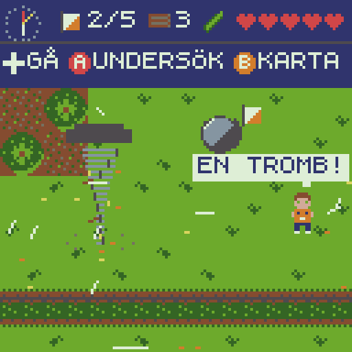
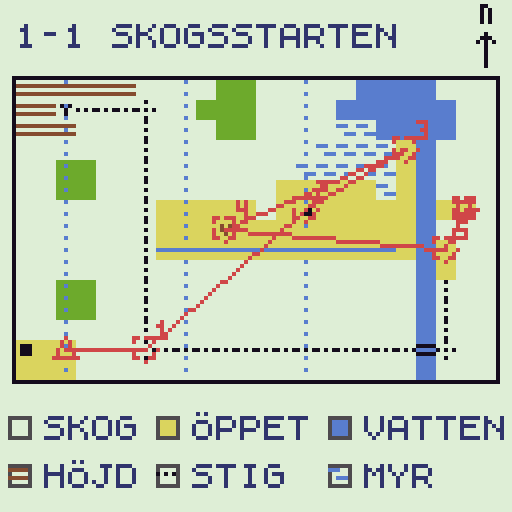
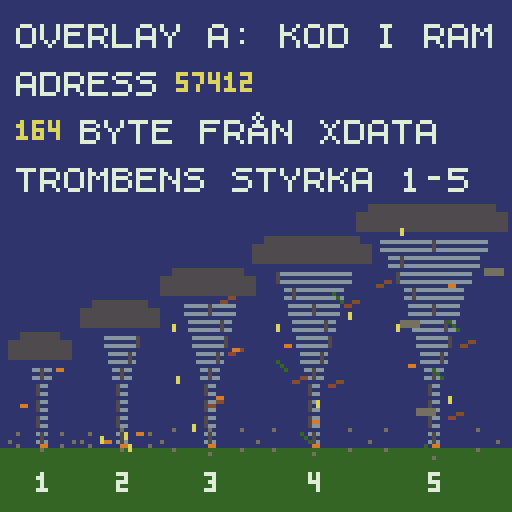
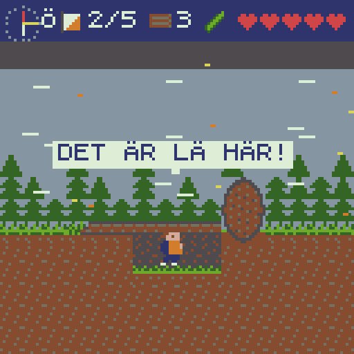
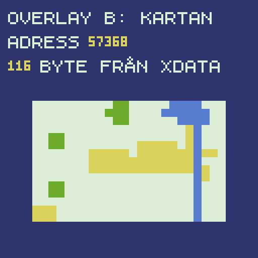

# SIXTENS EXPEDITION — designdokument

Status: **under implementation** (M26–M28 klara). De öppna frågorna och granskningen besluts av Claude på
människans uppdrag 2026-10-07 (D-044). Implementeras enligt PLAN.md Part 4 (M26–M32). Detta dokument, människans designutkast (de 38 avsnitten) och banfilerna (`levels/*.map`, skapas från
M26) är specifikationen och testernas facit. Där utkastet och de tio låsta besluten (§1) krockar gäller besluten,
och krocken står utskriven i §1.2. Frågorna i §11 har förslag som gäller om inget annat bestäms innan M26 börjar.
**All fakta och alla säkerhetsråd har en källa, och Claude har kontrollerat varje rad mot den (✓). Din egen
granskning (☐) står kvar som ett manuellt steg** (§1.3, §8.3, D-044).



*Mockup (§14): en skärm ur 1-1 Skogsstarten uppifrån, ritad av den riktiga VM:en i 128 × 128 och uppförstorad 4 ×.
Tromben (styrka 3) närmar sig från väster: vindpartiklar strömmar in mot den, gräset närmast böjer sig mot den, löv
och pinnar snurrar runt den. `mockup/mockup.gif` kan skannas med QR Console.*

---

## 0. Spelet på en minut

Sixten, 9 år, springer orientering när en tromb dyker upp i skogen. Vinden förändrar landskapet: träd faller, löv
blåser bort från kontroller, en sten flyttas och visar en grotta. Han tar sig fram genom fem världar med karta och
kompass, läser vinden och söker skydd på rätt ställe. Längs vägen fyller han en naturbok med djur, växter, stenar och
väder. Spelet visas **uppifrån, skärm för skärm** (som BLACKBOX och Zelda). Korta actionsträckor visas **från sidan**
(som Zelda II).

Spelets kärna: **ORIENTERA. OBSERVERA. FÖRSTÅ. UPPTÄCK.** Sixten ska inte besegra tromben. Han ska lära sig hur den
fungerar.

### 0.1 Sixten

- 9 år, orange orienteringströja, mörka byxor, vita löparskor, brunt hår, ryggsäck (syns i sidovy), karta och
  kompass. Inget vapen. Han löser allt med att springa, hoppa, klättra, orientera, observera och söka skydd.
- Uppifrån är han 8 × 16 px (huvud och kropp), framifrån i "trekvartsvy" som i Zelda. I sidovy är han 8 × 16 när han
  står och 8 × 14 när han hukar.
- **Utseendet är ett förslag.** Om det finns en riktig Sixten som spelet är till, kan han beskrivas eller fotograferas
  på samma sätt som Bo (Bo DESIGN §0.1). Det ändrar bara spritarna.

### 0.2 Identiteten: tre saker som gör det till Sixtens spel

1. **Orientering på riktigt.** Kartan är världen (beslut 2). Den visar allt utom var du är. Kontroller, vägval,
   kompasskurs och stegräkning är spelmekanik, inte dekoration.
2. **Tromben är ett väder, inte en fiende.** Den har förvarning, följer en bana, gör inte skillnad på Sixten och en
   sten, och lämnar världen förändrad. Det som först ser ut som ett problem (ett fallet träd) är ofta lösningen (en
   bro).
3. **Naturkunskap som belöning.** Allt man undersöker hamnar i naturboken. Inget behöver läsas för att klara en bana.

Spelets slingor: *utforska → orientera → upptäck → tromben dyker upp → observera vinden → välj väg → använd terrängen
→ nå kontrollen → lär dig något.* Känslan ska gå från `VAD HÄNDER?` via `VARFÖR?` till `JAG FATTAR!`. Slutrepliken
är `JAG FÖRSTÅR.`

## 1. Låsta designbeslut

Beslutade av människan före planeringen (2026-10-06):

| # | Beslut | Var det används |
|---|---|---|
| 1 | Orientering uppifrån skärm för skärm (BLACKBOX, Zelda). Sidovy för korta actionsträckor (Zelda II). Två motorer | §3 |
| 2 | Kartan är världen: en orienteringskarta av celler, **en byte per cell**, en cell = 4 × 4 tiles. Skärmen uppifrån expanderar celler till tiles, kartskärmen ritar samma data med orienteringssymboler | §4 |
| 3 | Tromben lever uppifrån som ett generiskt, deterministiskt objekt (position, riktning, fart, radie, styrka, varaktighet, vägpunkter), med förvarning och ett visuellt språk för styrka 1–5. Förändringar i världen är cellbyten. I sidovy är vinden bara en vågrät kraft | §6 |
| 4 | Spelet lär aldrig ut fel säkerhetsråd. Storm och tromb: skog är farlig. Åska: ensamma träd och höjder är farliga. Skydd: diken, sänkor, fasta byggnader. Fakta enligt MSB och SMHI, markerad för granskning | §1.1, §1.3, §8.3 |
| 5 | Kompassen behövs fast norr är uppåt: kartan visar inget "du är här" mellan kontroller och korsningar. Kompassen används i sidovy och på kompasskurs (myr, dimma, tät skog) | §5 |
| 6 | Koden sätter gränsen, inte datat (ISA 2). Data i xdata. Kod-overlays utreds | §12.4, §14 |
| 7 | En powerup, ett budskap: gurka = se, chips = fart, choklad = stå emot vinden | §8.1 |
| 8 | Bara en resurs, trä, som kommer från tromben (fallna träd blir plankor). Används på markerade byggplatser och ger alltid frivilliga genvägar | §8.4 |
| 9 | Sparning med bokstavskod som i BLACKBOX: 10 tecken ur 32, med värld, naturbok (~40 bitar) och kontrollsumma | §10.2 |
| 10 | 5 världar × 4 banor, högst ~40 naturboksuppslag, budgetgrind efter motorn och värld 1, kassett under ~25 KB komprimerad | §7, §12 |

### 1.1 Säkerhetsprincipen

**Spelet får aldrig belöna något som är farligt i verkligheten, och aldrig visa skydd där det inte finns skydd.**
Det gäller banornas form, bilderna, repliker, naturboken och powerups. Konkret:

- **Storm och tromb:** skogen är farlig (träd och grenar faller). Spelet visar det med knakande ljud, grenar som
  faller och träd som välter **innan** det kan göra illa. Skog är aldrig skydd.
- **Gå inte nära en tromb.** Inget i en bana (kontroll, naturboksuppslag, trä) ligger så att man måste in i trombens
  väg medan den är aktiv för att ta det. Det som tromben förändrar tas *efteråt*.
- **Skydd vid tromb:** en fast byggnad är bäst. Utomhus utan byggnad: ett dike eller en sänka, huka sig och skydda
  huvudet. I spelet syns skyddet som att vindpartiklarna inte når in (mockupens sidovy) och att Sixten hukar.
- **Åska:** aldrig under ett ensamt träd, inte på höjder eller öppen plan mark, inte i vatten. Utomhus: gå ner på
  knä i en svacka med fötterna ihop. Lägg dig inte platt.
- **Stormfälld skog och rotvältor:** gå inte nära. Träd kan vara i spänning, och en rotvälta kan resa sig igen. I
  spelet är fallna träd broar **först när tromben har passerat** och marken lugnat sig, och man går på stammen, inte
  vid rotvältan.
- **Inga powerups gör det säkert nära tromben.** Choklad hjälper mot vind (styrka 1–2) men aldrig mot själva
  tromben (§8.1).
- **Översvämning och ras:** gå inte i strömmande vatten, och håll avstånd från branter efter kraftigt regn.

### 1.2 Där utkastet ändras av de låsta besluten

| Utkastet säger | Beslutet säger | I designen |
|---|---|---|
| §5 "Spelet är ett sidorullande 2D-spel" | 1: uppifrån skärm för skärm + sidovy | uppifrån är huvudvyn. Sidovy finns bara i korta sträckor (§3) |
| §10 skydd "bakom stora stenar … under fasta konstruktioner … i skog" | 4: skog är farlig vid storm och tromb. Skydd = diken, sänkor, fasta byggnader | **skog stryks som skydd.** Stora stenar ger lä mot vind (styrka 1–2) men är inte skydd mot tromben. "Fasta konstruktioner" (broar, viadukter) stryks: under en viadukt blåser det mer, inte mindre ☐ |
| §17 resurserna trä, sten och järn | 8: bara trä | sten och järn stryks (Idéer för senare) |
| §21–25 fem banor per värld | 10: 4 banor per värld | V1:s "1-4 Stormen" och "1-5 Trombens spår" slås ihop till 1-4 (§7) |
| §28 5 liv och tillbaka till senaste kontrollen | – | behålls: 5 hjärtan per bana, `AJ!` = tillbaka till senaste kontroll, 0 hjärtan = banan börjar om |
| §29 sparning med bildkod | 9: bokstavskod (BLACKBOX) | bokstavskod (§10.2) |
| §14 choklad "kan flytta objekt, tål miljöhändelser" | 7: en powerup, ett budskap | choklad = **bara** stå emot vinden. Att flytta stenar sköter tromben |
| §12 gurka: "dolda orienteringsmarkeringar syns" | 7: gurka = se | behålls inom "se": "du är här" på kartan och kontroller syns på långt håll |

### 1.3 Säkerhetsregler i spelet och deras källor (granska ☐)

MSB heter sedan 2026 Myndigheten för civilt försvar (MCF). Länkarna är de som lästes vid planeringen (2026-10-06).

| # | Regeln i spelet | Hur spelet visar den | Källa | Kontroll |
|---|---|---|---|---|
| S1 | Gå inte nära en tromb | tromben är aldrig målet. Inget att hämta i dess väg medan den är aktiv | SMHI (citerat i SVT: "ska absolut inte gå nära en tromb", den "kan kasta omkring lösa föremål") | ✓ Claude · ☐ du |
| S2 | Vid storm: undvik skogen, träd och grenar faller | skog-celler blir farliga vid vind ≥ 3, med knak och fallande grenar som varning | Krisinformation/MCF om storm. Länsstyrelsen: "undvik att vistas i stormfälld skog" | ✓ Claude · ☐ du |
| S3 | Skydd vid tromb: fast byggnad. Ute utan byggnad: dike eller sänka, huka, skydda huvudet | stugan är bästa skyddet (banorna lägger den på säkra vägen när det går); dike och sänka är skydd när man inte hinner in. Sixten hukar när han står still där | Byggnad: UD:s krisråd (stormar: inomhus, källare eller fönsterlösa rum i större byggnader), SMHI (gå inte nära). Dike/sänka: bara amerikanska NWS (weather.gov, Tornado Safety); en svensk källa hittades inte (sökt 2026-10-07) | ✓ Claude · ☐ du |
| S4 | Åska: inte under ensamma träd, inte på höjder eller öppen plan mark | ensamma träd och höjder lyser upp av blixtfara i V4. Skydd = svacka | SMHI, *Skydd mot blixten* (smhi.se/kunskapsbanken/meteorologi/aska/skydd-mot-blixten) | ✓ Claude · ☐ du |
| S5 | Åska i öppen terräng: gå ner på knä i en svacka, fötterna ihop. Ligg inte platt | Sixtens hukpose i V4 är på knä, inte liggande | SMHI (samma sida): "i någon svacka i terrängen gå ned på knäna" | ✓ Claude · ☐ du |
| S6 | Åska: bada inte, gå upp ur vattnet | inga vattensträckor under åska. Bryggor stängs när åskan närmar sig | SMHI (samma sida) | ✓ Claude · ☐ du |
| S7 | Gå inte nära stormfällda träd och rotvältor (spänning, rotvältan kan resa sig) | fallna träd blir broar först när tromben passerat. Rotvältan är aldrig ett skydd | Länsstyrelsen/Skogsstyrelsen om stormfälld skog | ✓ Claude · ☐ du |
| S8 | Gå inte i strömmande vatten vid översvämning | översvämmade celler är aldrig vägen i V3. Strömmen tar Sixten tillbaka (`AJ!`) | MCF *Översvämning* | ✓ Claude · ☐ du |
| S9 | Håll avstånd från branter vid kraftigt regn (ras och skred) | rasbranter i V2 och V3 varnar med rinnande grus | MCF *Ras och skred* | ✓ Claude · ☐ du |
| S10 | Under en viadukt eller bro blåser det mer vid tromb | sådana platser finns inte som skydd i spelet | NWS (samma källa som S3) | ✓ Claude · ☐ du |

Det spelet **inte** lär ut: att man kan springa ifrån en tromb, att vind kan "stås emot", eller att ett fallet träd är
en lekplats.

## 2. Kontroller

| Knapp | Uppifrån | Sidovy | Karta och menyer |
|---|---|---|---|
| Styrkors | gå (4 riktningar, glider runt hörn) | ←/→ gå, ↑/↓ klättra (stegar, rötter, klippor) | välja |
| A | undersök/använd: naturbok, bygga, läsa en skylt. HUD:ens andra rad visar vad A gör just nu | hoppa | välja/OK |
| B | kartan (spelet pausar) | kartan (spelet pausar) | tillbaka |
| *stå stilla* | i en skyddscell: Sixten hukar efter 0,5 s = i skydd | i lä (bakom något, sett från vinden): hukar = i skydd | – |

- Kontroller **stämplas automatiskt** när Sixten går in på dem: `BIP!` och flaggan blinkar. Inget extra att lära sig.
- Att söka skydd kräver ingen knapp. Man går dit och står still. Det är så verkligheten fungerar också, och det gör
  regeln testbar (§6.5).
- Pekskärm: styrkors och två knappar, som i de andra spelen. Inga knappkombinationer.

## 3. De två vyerna

### 3.1 Uppifrån (huvudvyn)

- Skärmen är **4 × 3 celler = 16 × 12 tiles = 128 × 96 px** under en HUD på 32 px. Man går mellan skärmar som i Zelda:
  vid kanten glider nästa skärm in (16 bildrutor). Celler expanderas till en kolumnvis tilebuffert och ritas med ett
  `MAP` per kolumn (16 anrop), så att glidningen i sidled bara är en förskjutning.
- Motorn bygger på BLACKBOX:s rum, spelare och kodinmatning (`games/blackbox/room.asm`, `player.asm`, `code.asm`):
  kollision mot tile-klasser, ingångar och utgångar och ett skärmbyte i taget. Skillnaden är att ett "rum" inte
  lagras. Det expanderas ur cellkartan.
- Bana: upp till **24 × 15 celler** (6 × 5 skärmar, 360 byte), som 1-1. Större får inte plats på kartskärmen med
  5 px per cell och teckenförklaringen (M26, D-041).

### 3.2 Sidovy (korta actionsträckor)

- 2–6 skärmar bred, scrollar vågrätt, en kolumnvis buffert (16 rader) och `MAP` per kolumn, samma teknik som Bo.
- Fysik: gå, hopp (A, variabel höjd), klättra (↑/↓ på klättringsbara tiles), huka. **Vinden är bara en vågrät kraft**
  (beslut 3): `vx += vind` varje bildruta, utom när Sixten står i lä bakom något sett från vinden, eller har choklad.
- Sidovyn är en egen liten bana i xdata (`levels/*.side`, 14 rader, 32–96 kolumner) med konstant vind, väderstrecket
  åt höger, himlens färg och startplatsen. Ingång och utgångar kopplas till celler i kartan (`side:` i `.map`).
- **Lä:** med vind är Sixten i lä när något fast finns inom 14 px mot vinden vid fötterna, och vid huvudet om han
  inte hukar. Bakom en sten på en tile måste han huka. Bakom rotvältan räcker det att stå.
- Toppen på rötter och grepp går att stå på (↓ klättrar ned igen).

| Tecken | Tile i sidovyn | Fast/klättra |
|:--:|---|---|
| ` ` | himmel | – |
| `g` | mark med gräs | fast |
| `d` | jord | fast |
| `x` | dikets/ravinens bakvägg | – |
| `f` | dikets botten | fast |
| `L` | stam på marken | fast |
| `l` | stam över diket/ravinen | fast |
| `c` | trädets krona (på marken) | fast |
| `A` | grantopp (bakgrund) | – |
| `Y` | gran (bakgrund) | – |
| `#` | berg | fast |
| `h` | grepp i berget | klättra |
| `r` | rötter | klättra |
| `k` | grottans mörker | – |
| `o` | sten | fast |
| `1`–`6` | rotvältan (2 × 3 tiles) | fast |

### 3.3 När vyn byts

Bara på **markerade övergångsceller** (celltyp `SIDE`, §4.1): en grottöppning, en brant med klätterstig, en ravin
med ett fallet träd över, en fors. Man går in i cellen och trycker A (`A: KLÄTTRA`, `A: GÅ IN`). Sidovyn spelas, och
vid utgången står man på utgångscellen uppifrån. Kartan pausar i båda vyerna och visar samma karta. I sidovy visar
kompassen åt vilket väderstreck Sixten tittar (höger = `Ö` i mockupen), eftersom höger inte alltid är öster.

Sidovyn är ingen fjärde motor. Den laddas som **kod-overlay** (§12.4), eftersom de två motorerna aldrig körs
samtidigt.

## 4. Cellformatet och kartsymbolerna

### 4.1 En byte per cell

```
bit 7      kontroll står här (kontrollens nummer står i banans kontrollista)
bit 6      täckt av löv (kontrollen eller föremålet syns inte förrän vinden blåst bort löven)
bit 5      variant (mönstrets övre och nedre halva byter plats: skogen ser inte ut som ett rutmönster)
bit 4..0   typ (32)
```

| Typ | Tecken | Namn | Uppifrån (4 × 4 tiles) | Kartfärg | Kartsymbol | Fart (px per bildruta) | Regler |
|---:|:--:|---|---|---|---|---:|---|
| 0 | `.` | öppen mark | gräs, tuvor | gul | – | 1 | går. Vid tromb: vinden knuffar |
| 1 | `T` | skog (lättlöpt) | två granar + skogsbotten | vit | – | 0,875 | går. **Farlig vid vind ≥ 3** (S2) |
| 2 | `#` | tät skog | tätt med kronor | grön | – | 0,5 | går långsamt. Farlig vid vind ≥ 3 |
| 3 | `=` | stig öst–väst | stig | vit | svart streckad, öst–väst | 1,25 | snabbare |
| 4 | `\|` | stig nord–syd | stig | vit | svart streckad, nord–syd | 1,25 | snabbare |
| 5 | `+` | korsning | korsande stigar | vit | svart streckad, båda | 1,25 | **"du är här" på kartan** (beslut 5) |
| 6 | `~` | myr | gräs och pölar | vit | blå streck | 0,625 | inga landmärken: kompasskurs |
| 7 | `W` | vatten | vatten | blå | – | – | går inte (sidovy: simma kort) |
| 8 | `^` | höjd/berg | häll | vit | bruna höjdkurvor | – | går inte. Farlig vid åska |
| 9 | `v` | dike | dike | gul | blått streck | 0,75 | **skydd** (tromb) |
| 10 | `u` | sänka | skål | gul | brunt u | 0,875 | **skydd** (tromb, åska) |
| 11 | `H` | byggnad (fast) | röd stuga | gul | svart ruta | 1 | går in (Sixten syns inte där inne): **skydd** (bäst) |
| 12 | `o` | stort block | sten | gul | svart prick | 1 | lä mot vind 1–2. **Inte skydd** mot tromb |
| 13 | `L` | fallet träd | stam, krona, rot | gul | svart kryss | 0,75 | går (på stammen): en bro när tromben passerat (§6.4) |
| 14 | `b` | bro/plankor | plankor över vatten | blå | svarta streck | 1 | går |
| 15 | `B` | byggplats | pinnar och snöre | gul | lila ruta | 1 | A + trä = bro/stege (§8.4) |
| 16 | `G` | grotta | öppning i berget | vit | svart v | – | går inte. Övergång till sidovy (M28) |
| 17 | `S` | start | gräs | gul | triangel (banan) | 1 | **"du är här"** |
| 18 | `M` | mål | gräs | gul | dubbelring (banan) | 1 | – |
| 19 | `i` | ensamt träd | en gran | gul | grön prick | 1 | **farlig vid åska** (S4) |
| 20 | `X` | vindfälle | stammar i kors | vit | svart kryss | – | går inte: blockerar en stig (§6.4) |
| 21 | `Q` | strömmande vatten (fors, översvämning) | vatten med strömmar | blå | vita streck | 0,375 | går, men **farligt** (S8): 20 bildrutor i det = `AJ!` |
| 22 | `R` | ras | sten och grus | vit | bruna prickar | – | går inte: blockerar (ett ras, §6.6) |
| 23–31 | | reserverade: dimma (en flagga per värld), klätterstig … | | | | | högst två nya fenomen per värld (§7) |

- **Fart** är px per bildruta (60 bildrutor per sekund), i motorn i 1/16 px. "–" = går inte (kollision mot cellens
  typ, Sixtens fotlåda är 6 × 4 px; vid ett hörn glider han runt). Varianten (bit 5) sätts av generatorn för öppen
  mark och skog: `((kolumn × 7 + rad × 3) >> 1) & 1`.
- **Expansion:** en mönstertabell med 16 tile-index per typ (16 B × 32 typer = 512 B, delas av alla världar).
  Världens tiles bestämmer hur de ser ut. För varianten byter mönstrets halvor plats (spegling
  vänster-höger provades och delade granarna på 2 × 2 tiles). Uppmätt i mockupen: att expandera hela skärmen (12 celler)
  kostar ~5 400 cykler, och en bildruta med expansion och ritning högst 10 627 (§14). I spelet (M26) är en bildruta
  med skärmbyte, två expansioner, ritning och HUD högst 13 613 cykler.
- **Kartskärmen** läser samma byte: fyllfärg och symbol per typ ur två tabeller med 32 byte var. Det är därför kartan
  *alltid* stämmer med världen: ett cellbyte (fallet träd, löv som blåser bort, översvämning) syns direkt på båda.
- Kartfärgerna följer orienteringskartans stil (ISOM, förenklad): vit skog, gul öppen mark, grön tät skog, blått
  vatten, bruna höjder, svarta stigar och byggnader. **Banan ritas i rött**: paletten (DawnBringer 16) saknar den
  magenta som riktiga kartor använder.



*Kartskärmen i mockupen: 1-1 med 5 px per cell, nordlinjer, banan S → 1 … 5 → mål i rött och teckenförklaringen.
Varje färg och symbol kommer från samma 360 byte som skärmen uppifrån.*

### 4.2 Banfilen (`levels/1-1.map`)

En textfil per bana: ett huvud (namn, värld, storlek), cellkartan som text (ett tecken per cell, som §13.1), en
kontrollista (nummer, cell, obligatorisk/frivillig/hemlig), övergångar till sidovyer, trombernas vägpunkter och
cellbyten (§6.4), djur och naturboksobjekt. Generatorn `tools/levels.ts` packar cellkartan med `.pack` i xdata och
skriver en förhandsbild (`levels/1-1.png`: uppifrån och kartan bredvid varandra). Filen är testernas facit.

## 5. Kompassen och "var är jag?"

- **Norr är alltid upp**, både på skärmen och på kartan. Därför kan spelet vara ärligt: kartan stämmer, men den
  säger inte var du är.
- Kartan visar en blinkande "du är här" **bara** när Sixten står på en kontroll, en korsning (typ 5), startcellen,
  eller har gurka (§8.1). Annars får man räkna ut det från terrängen: "jag gick förbi stenen och är vid diket".
- **Kompassen i HUD:** en ring med röd nål mot norr och en gul pil.
  - **Uppifrån visar pilen kursen.** På kartan väljer man nästa kontroll när man står på en känd punkt, och pilen
    ställs mot den (16 riktningar). Det är orienteringens "ta ut kursen". En **stegräknare** visar hur många celler man
    har gått sedan dess. Utan landmärken (myr, dimma, tät skog, där skärmarna ser lika ut) följer man pilen och
    räknar steg.
  - **I sidovy visar pilen åt vilket väderstreck Sixten tittar**, med bokstaven bredvid (`Ö`, `V`, `N`, `S`).
- Kompassen ljuger aldrig. I dimma (V4) blir skärmen grå, men kompassen och stegräknaren fungerar.

## 6. Tromben som system

### 6.1 Objektet

En tromb är ett objekt i RAM: läge (1/16 px), styrka 0–5, vägpunkt, bildrutor kvar på sträckan, väntetid,
vindriktning (16-dels varv) och en egen klocka. Banfilen ger dess vägpunkter: *(cell, styrka, fart i 1/16 px per
bildruta, väntetid)* och vilken kontroll som startar den (`whirl:` i `.map`, §4.2). Tromben går rakt mot nästa
vägpunkt. Generatorn räknar varje sträcka som heltalssteg (Bresenham): exakt framme vid vägpunkten och aldrig mer än
farten på en bildruta. Styrkan ändras ett steg per sekund (60 bildrutor), aldrig mer. Radien är 24 + 8 × styrka px.
En tromb i taget (M27): startas en till medan en är aktiv väntar den på sin tur. Banorna har hittills bara en åt
gången.

**Ingen slump.** Allt är en funktion av vägpunkterna och tiden sedan tromben startade. Den startar på en händelse i
banan (Sixten stämplar kontroll n, eller går in i en viss cell). Två körningar med olika RNG-frö ger exakt samma
trombtillstånd i varje bildruta. Tromben **följer aldrig Sixten** och vet inte var han är.

### 6.2 Faserna och förvarningen

| Fas | Vad syns och hörs | Farligt? |
|---|---|---|
| 1. Moln | himlen mörknar (HUD-kanten och marken blir en nyans mörkare), första vindbruset | nej |
| 2. Vind | gräs böjer sig mot trombens väg, löv lyfter, ljudet stiger | nej |
| 3. Syns | virveln syns, dammring vid foten | styrka 1–2: nej |
| 4. Kraft | styrka ≥ 3: föremål flyger, skog knakar | **ja** inom radien |
| 5. Passerar | tromben följer vägpunkterna. Cellbyten sker vid vägpunkter (§6.4) | ja |
| 6. Dör ut | styrkan sjunker, vinden mojnar, det blir tyst | nej |

**Förvarningsregeln (testas):** från första varningssignalen (fas 1) till att styrkan blir ≥ 3 någonstans på den
skärm där Sixten står går **minst N = 5 s (300 bildrutor)**. Motorn: varningen (fas 1–2, styrka 0, vind och löv)
varar 150 bildrutor, sedan ett styrkesteg per 60, så styrka 3 kommer tidigast 330 bildrutor efter starten. Kartan
pausar tromben. Skärmbyten gör det inte. Innan tromben svänger mot en ny vägpunkt vänder vinden
(gräset, löven) **minst 2 s** före. "Jag kunde ha sett det." Utkastets "får inte teleportera" blir testregeln: ingen
förflyttning per bildruta är större än farten.

### 6.3 Det visuella språket för styrka 1–5

| Styrka | Utkastet (§32) | Hur det ritas (mockup, overlay A) |
|---:|---|---|
| 1 | löv flyger | låg tunn virvel (5 lager), dammring, gula och orange löv |
| 2 | gräs böjer sig | högre (7 lager), gräset på skärmen böjer sig mot den |
| 3 | små föremål flyger | 9 lager, pinnar i luften |
| 4 | träd rör sig | 11 lager, kvistar. (Att träden på skärmen gungar, med tile-växling, är inte gjort än) |
| 5 | stora objekt påverkas | 13 lager, brett moln, plankor i luften |

Varje virvel är 3 + 2 × styrka lager med 4 px mellan, halvbredd 1 + i²/12. Ett mörkt band snurrar runt (rotationen),
och löv och skräp kretsar med 3 × styrka bitar. Ljudet följer styrkan: svagt brus (långt bort), stigande vind,
kraftigt brus (passerar), vinden dör ut.



*Styrkeskalan 1–5 ritad av overlay A i mockupen: kod som kopierats från xdata till RAM-adress 0xE000 och körs där.*

### 6.4 Förändringar i världen = cellbyten

Banfilen listar cellbyten per vägpunkt: *(vägpunkt, cell, ny byte)*. Ett byte sker bara när tromben når vägpunkten,
och bara inom dess radie. Det kontrolleras av generatorn och testerna. Exempel:

| Före | Efter | Vad det betyder |
|---|---|---|
| `T` skog vid ett dike | `L` fallet träd över diket | ny väg (bro) när tromben passerat. Trä att hämta |
| cell med bit 6 (löv) | samma cell utan bit 6 | en dold kontroll syns |
| `o` block framför berget | `.` + `G` grotta | en sten flyttas och visar en grotta |
| stig `=` | `X` vindfälle | stigen blockeras: välj en annan väg |

Kartan ritar om cellen direkt (beslut 2). (Att den ändrade cellen blinkar en gång nästa gång kartan öppnas kommer
med M29.)

### 6.5 Skydd och skada

- **Skada:** inom trombens radie vid styrka ≥ 3, om Sixten *inte* står stilla i en skyddscell (dike, sänka,
  stugan): efter 20 bildrutor `AJ!`, ett hjärta, tillbaka till senaste stämplade kontrollen (2 s utan ny skada). I
  skog inom radien + 64 px vid styrka ≥ 3: en grens skugga växer under honom i 1 s, sedan `AJ!`. Utan hjärtan börjar
  banan om. (Att vinden knuffar Sixten på öppen mark är inte gjort än: i sidovyn kommer kraften med M28.)
- **Skydd:** står still i en skyddscell. Efter 0,5 s hukar Sixten och vindljudet blir dovt. I stugan syns han inte
  alls. Det syns utan text (utkastets "här blåser det mindre").
- **Lä (vind 1–2, sidovy):** bakom ett block, en vägg eller dikeskanten sett från vinden. Vinden knuffar inte.

### 6.6 Andra fenomen: händelser (M30)

Fallande träd, ras och översvämning är **händelser** i banfilen (`event:` i `.map`): vilken kontroll som startar
den (eller banans start), typ, när den sker (bildrutor efter starten), hur länge varningen syns innan, och vilka
celler som ändras. Som tromben: ingen slump, och den vet inte var Sixten är. Klockan går i spel och skärmbyten (kartan
och naturbokssidor pausar den).

| Typ | Varning (syns på cellerna) | Vad som händer | Skada |
|---|---|---|---|
| fallande träd (storm) | växande skuggor, knak var halvsekund; **minst 120 bildrutor** | cellerna blir vindfällen `X` | `AJ!` om Sixten står där |
| ras | grus som rinner ned, muller; **minst 120 bildrutor** | cellerna blir ras `R` | `AJ!` om Sixten står där |
| översvämning | krusningar (eller ingen: vattnet stiger i regnet) | cellerna blir strömmande vatten `Q` | i `Q`: 20 bildrutor = `AJ!` (S8) |

I värld 3 regnar det hela tiden (strimmor över skärmen). Forsen i 3-4 är `Q` från början. Varje värld har sin egen
markfärg (värld 2 khaki efter stormen, värld 3 blöt mörkgrön) och sin egen musikslinga.

## 7. Världar, banor och fenomen

Högst två nya fenomen per värld. Varje nytt fenomen introduceras ensamt i en bana innan det kombineras.

| Värld | Nya fenomen | Banor (4) | Sidovy |
|---|---|---|---|
| **1 Skogen** | vind, liten tromb (styrka ≤ 3) | 1-1 Skogsstarten (karta, kontroller, den första lilla tromben), 1-2 Sjön (vatten och vägval), 1-3 Berget (höjder, kompass. Grottan = första sidovyn), 1-4 Trombens spår (den första trombbanan: läs vinden, välj väg, det fallna trädet blir bro) | 1-3, 1-4 |
| **2 Kraften** | fallande träd (stormfälld skog), ras | 2-1 Stormen (kontroll 1 startar stormen: granarna faller över skogsstigen, säkra vägen går över öppen mark), 2-2 Rasbranten (raset begraver stigen under slänten), 2-3 Stenarna (tromben flyttar blocket: grottan öppnas, med sidovy), 2-4 Skogen efter stormen (vindfällen, trä, byggplatsens bro) | 2-3 |
| **3 Vattnet** | kraftigt regn/översvämning (celler blir strömmande vatten), strömmar | 3-1 Regnet (ängen svämmar över), 3-2 Bäcken svämmar över (låga bron först, sedan stränderna; höga bron är torr), 3-3 Myren (kompasskurs), 3-4 Forsen (bara bron går över) | – |
| **4 Himlen** | åska (ensamma träd, höjder, svacka), dimma | 4-1 Åskan, 4-2 Dimman (kompass och steg), 4-3 Fjället (kalfjäll + åska), 4-4 Molnens väg (hur ett bymoln ger en tromb) | 4-3 |
| **5 Expeditionen** | inga. Allt kombineras | 5-1 Kartan och vinden, 5-2 Natten (mörker + kompass, ej nytt fenomen: bara mörkare palett), 5-3 Vattnet stiger, **5-4 Den stora tromben** (finalen, styrka 5) | 5-4 |

**Finalen (5-4):** ingen boss och ingen knapp som stoppar tromben. En stor bana där en styrka 5-tromb följer sina
vägpunkter genom landskapet. Sixten läser vinden, tar kontrollerna i rätt ordning, söker skydd i stugan och diket,
använder det tromben flyttat och väljer väg. I mål drar tromben bort, det blir tyst, han tittar på kartan: `JAG
FÖRSTÅR.` Spelet säger inte att han vann över tromben.

Rymden (utkastets planeter och stjärnor) och sten/järn är inte med (§11 fråga 11–12, *Idéer för senare*).

## 8. Powerups, naturbok, fakta och trä

### 8.1 Powerups: en powerup, ett budskap

| Powerup | Budskap | Effekt (15 s, syns som ikon i HUD) | Var den finns |
|---|---|---|---|
| **Gurka** | se | `FOKUS!` Kartan visar "du är här" hela tiden. Kontrollflaggor syns som pilar i skärmkanten när de är inom 2 skärmar | före myrar, dimma och tät skog |
| **Chips** | fart | Sixten springer 1,5 × och hoppar längre i sidovy. Musiken går snabbare (som Bos pommes) | före öppna sträckor där man vill hinna till ett skydd |
| **Choklad** | stå emot vinden | vinden knuffar inte Sixten (styrka 1–2, sidovyns vågräta kraft). **Skyddar inte mot tromben** (styrka ≥ 3 i radien skadar ändå, S1) | i blåsiga sidovyer och på öppna fält |

En powerup i taget, tagen genom att gå på den. En ny ersätter den gamla. Varar 900 bildrutor (15 s).

### 8.2 Naturboken (40 uppslag)

Första gången Sixten undersöker något (A bredvid det) blir det ett uppslag: bild, namn och 1–2 korta meningar.
Uppslaget registreras med `PLING!` och boken räknas på kartskärmen (`NATURBOK 12/40`). Den är kosmetisk och ger inga
fördelar, men den sparas i koden (beslut 9) och en full bok syns i slutet.

| Kategori | Uppslag |
|---|---|
| Väder (8) | TROMB, VIND, BYMOLN, ÅSKA, BLIXT, REGN, DIMMA, STORM |
| Djur (10) | ÄLG, RÄV, IGELKOTT, GRODA, BÄVER, HUGGORM, KORP, HACKSPETT, EKORRE, MYRA |
| Växter och svampar (9) | GRAN, TALL, BJÖRK, BLÅBÄR, LINGON, VITMOSSA, KANTARELL, FLUGSVAMP, ÖRNBRÄKEN |
| Sten och mark (7) | GRANIT, FLYTTBLOCK, JÄTTEGRYTA, RULLSTENSÅS, LERA, SAND, KALKSTEN |
| Landskap (6) | MYR, BÄCK, KÄLLA, ROTVÄLTA, DIKE, SÄNKA |

### 8.3 Exempel på fakta (granska ☐)

| Uppslag | Text i spelet | Källa att kontrollera mot | Kontroll |
|---|---|---|---|
| TROMB | EN VIRVELVIND SOM NÅR NER TILL MARKEN FRÅN ETT ÅSKMOLN. I SVERIGE SES NÅGRA VARJE SOMMAR. GÅ ALDRIG NÄRA. | SMHI kunskapsbanken (tromber) | ✓ Claude · ☐ du |
| BYMOLN | ETT HÖGT, TORNANDE MOLN. DET KAN GE ÅSKA, HAGEL, SKYFALL OCH IBLAND EN TROMB. | SMHI: tromber bildas i kraftiga bymoln (cumulonimbus) | ✓ Claude · ☐ du |
| ÅSKA | STÅ ALDRIG UNDER ETT ENSAMT TRÄD. GÅ NER PÅ KNÄ I EN SVACKA, FÖTTERNA IHOP. | SMHI, *Skydd mot blixten* | ✓ Claude · ☐ du |
| FLYTTBLOCK | EN STOR STEN SOM INLANDSISEN FLYTTADE. DEN KAN LIGGA LÅNGT FRÅN BERGET DEN KOM IFRÅN. | SGU | ✓ Claude · ☐ du |
| VITMOSSA | VÄXER I MYREN OCH KAN SUGA UPP MYCKET MER VATTEN ÄN DEN VÄGER. | SGU/naturvårdsverket | ✓ Claude · ☐ du |
| HUGGORM | SVERIGES ENDA GIFTORM. DEN ÄR SKYGG. GÅ RUNT OCH LÅT DEN VARA. | Naturhistoriska riksmuseet | ✓ Claude · ☐ du |
| ROTVÄLTA | NÄR ETT TRÄD BLÅSER OMKULL FÖLJER RÖTTERNA MED. GÅ INTE NÄRA: DEN KAN RESA SIG IGEN. | Skogsstyrelsen (stormfälld skog) | ✓ Claude · ☐ du |

Texten är versaler i spelets font (som Bo), högst 2 rader à 20 tecken per sida och högst 3 sidor per uppslag. Alla
40 uppslag skrivs i `NATURBOK.md` före M29 och granskas där. Ett test kontrollerar att varje uppslag har en källa och
en bock.

### 8.4 Trä

- Trä kommer **bara** från tromben: ett fallet träd (`L`) ger 2 plankor (en gång per träd) när tromben passerat. A bredvid stammen,
  inte vid rotvältan (S7).
- Byggplatser (`B`) är markerade med pinnar och snöre uppifrån och med lila på kartan. `A: BYGG` med tillräckligt trä
  gör en cell till en bro eller en stege (cellbyte; `build:` i `.map` anger vilken). Det kostar 2 plankor.
- **Alltid frivilligt:** varje byggplats är en genväg eller vägen till en frivillig kontroll eller ett
  naturboksuppslag. Säkra vägen (testas med botrutten) kräver aldrig trä.

## 9. Kontroller per bana, liv och mål

- Varje bana har 2–4 **obligatoriska** kontroller (i ordning, numrerade på kartan), 1–2 **frivilliga** och en
  **hemlig** (täckt av löv, bakom en byggplats eller i en sidovy). 1-1 har 4 + 1 (§13).
- Tre mål per bana (utkastet §20): **ta dig fram** (mål), **orientera** (alla kontroller), **upptäck** (bankens
  naturboksuppslag). De visas som tre ikoner på världskartan.
- **5 hjärtan** per bana. `AJ!` = ett hjärta och tillbaka till senaste stämplade kontroll (världen är kvar som den
  är: cellbytena ligger kvar). 0 hjärtan = banan börjar om. Inget annat går förlorat.
- Ingen fiende. Djur är fridfulla (huggormen backar undan, en älg står i vägen ett tag). Faror är väder och terräng.

## 10. HUD, skärmar och sparkod

### 10.1 HUD (32 px, två rader)

Rad 1: kompassen (nål + kurspil), stämplade kontroller (`2/5`), trä, aktiv powerup och hjärtan.
Rad 2: knapparna med vad de gör just nu (`✚ GÅ  Ⓐ UNDERSÖK  Ⓑ KARTA`). A:s ord byts efter läget (`BYGG`,
`KLÄTTRA`, `GÅ IN`, `LÄS`). I sidovy finns bara rad 1 (16 px) och bokstaven för väderstrecket.

Skärmarna runt spelet följer Bo: titel, världskarta (banorna med tre målikoner), bankort, kartskärm, naturboken
(B på världskartan), resultat, kodskärm och slut.

### 10.2 Sparkoden

**10 tecken ur 32 = 50 bitar**, BLACKBOX:s alfabet (`ABCDEFGHJKLMNPQRSTUVWXYZ23456789`: inga I/O, inga 0/1). Tecken j
är bitarna 5j–5j+4 (högsta först) XOR (7j + 3) mod 32. Bitarna, högsta först i varje fält:

| Bitar | Innehåll |
|---:|---|
| 3 | värld 1–5 (6 = spelet klart) |
| 40 | naturboken, ett uppslag per bit |
| 7 | kontrollsumma: summan av (i + 1) för varje satt bit i = 0–42, mod 128 |

Koden visas på världskartan och i slutet. Banornas kontroller och trä sparas inte (världens banor kan spelas om).
Kontrollsumman gör att 1 av 128 slumpkoder slinker igenom. Det är okej för ett barnspel, och omöjliga koder (värld
utanför 1–6) avvisas också. **Förslag:** om naturboken växer över 40 uppslag stryks uppslag, inte kontrollsumman.

## 11. Utkastets öppna frågor: förslag

**Beslutat 2026-10-07:** människan lät Claude bestämma; förslagen nedan gäller (D-044).

| # | Fråga | Beslut |
|---|---|---|
| 1 | Helt sidscrollande eller åt båda håll? | **Uppifrån skärm för skärm åt alla fyra håll** (beslut 1). Sidovyerna scrollar åt båda håll |
| 2 | Hur öppnas kartan? | **B**, helskärm, spelet pausar (även tromben). B eller A stänger. Barnet får tänka utan stress. Tromben är förutsägbar ändå |
| 3 | Riktig eller förenklad kompass? | **Förenklad:** nålen mot norr, en kurspil i 16 riktningar som ställs vid en känd punkt, stegräkning i celler. Ingen missvisning |
| 4 | Hur mycket av kartan visas från början? | **Hela kartan**, som en riktig orienteringskarta. Det som är dolt är *var du är*. Förändringar ritas in direkt (beslut 2) |
| 5 | Obligatoriska kontroller eller bonus? | Båda: 2–4 obligatoriska i ordning, 1–2 frivilliga och 1 hemlig (§9) |
| 6 | Hur många kontroller per bana? | 4–6 (1-1: 4 + 1) |
| 7 | Kan tromben ändra riktning? | **Ja, vid vägpunkter**, och vinden vänder minst 2 s innan (§6.2) |
| 8 | Kan tromben följa Sixten? | **Nej, aldrig.** Den vet inte var han är (testas: samma tromb oavsett Sixtens väg) |
| 9 | Hur realistisk meteorologi? | Fakta och säkerhetsråd **korrekta och granskade**. Rörelsen förenklad (raka sträckor, styrka 1–5 i stället för EF-skalan, som nämns i naturboken) |
| 10 | Naturboken i koden? | **Ja**, 40 bitar (beslut 9) |
| 11 | Rymden som värld eller bonus? | **Inte med.** *Idéer för senare*: kostar en värld med egna tiles och bryter mot "en tromb i skogen" |
| 12 | Minecraft-resurser? | **Bara trä**, alltid frivilligt (beslut 8) |
| 13 | Pokémon-naturbok central eller bonus? | **Bonus som syns:** räknare på kartan, `PLING!`, sparas, full bok i slutet. Krävs aldrig |
| 14 | En riktig trombbana där man förutser rörelsen? | **Ja:** 1-4 Trombens spår (första), 2-1 Stormen och finalen 5-4 |
| 15 | Antal världar och banor? | **5 × 4 = 20** (beslut 10), med budgetgrind efter V1 |

## 12. Budget

### 12.0 Budgetgrinden efter värld 1 (M29, uppmätt 2026-10-07)

ROM **20,6 KB** (kod 14,3 KB, data 6,3 KB), sidomotorn 2,0 KB i xdata, xdata totalt 6,4 KB, kassett **14,9 KB**.
Största koden: tromben 3,0 KB, skärmarna 2,5 KB, kartskärmen 2,4 KB, Sixten 1,4 KB, objekten 1,4 KB, banan 1,3 KB.
Framräknat till fem världar (sex fenomen à ~0,35 KB, kodinmatning 0,6 KB, slutet 0,5 KB, musik; 32 bilder och 16
banor till): ROM **27–28 KB** av 32, xdata 10–12 KB, kassett **21–23 KB** (samma kompression som nu). Under målet
25 KB: ingen nedskärning behövs (D-045).

### 12.1 Kalibrering mot Bo och BLACKBOX (uppmätt ur assemblerns listning, 2026-10-06)

| Bo (ROM 31,6 KB, kod 25,4 KB) | kod (B) | BLACKBOX (kod 10,9 KB) | kod (B) |
|---|---:|---|---:|
| `actors.asm` (13 fiender, 9 beteenden) | 4 576 | `actors.asm` (vakter, kameror, drönare) | 2 684 |
| `screens.asm` (titel, intro, karta, resultat, kod, slut) | 4 324 | `text.asm` | 1 644 |
| `player.asm` (skatefysik) | 3 760 | `script.asm` | 1 268 |
| `level.asm` (uppackning, kamera, kollision) | 3 104 | `player.asm` (uppifrån) | 1 208 |
| `boss.asm` + `dozer.asm` | 3 200 | `room.asm` (rum, dörrar) | 1 000 |
| `drawbo.asm`, `draw.asm`, `bubble.asm` | 3 336 | `boss.asm` | 1 008 |
| `items.asm`, `tricks.asm` | 2 348 | `draw.asm` | 464 |
| `sound.asm`, `menu.asm`, `bo.asm` | 752 | `code.asm` (access codes) | 388 |

Bos data: ROM 6,0 KB resident + 8,5 KB xdata. Kassett 22,9 KB (ROM + xdata ≈ 40 KB → 57 %). Mockupen för Sixten:
kod 4,6 KB, kassett 4,5 KB.

### 12.2 Sixten: uppskattning

| Del | Kod (KB) | Grund |
|---|---:|---|
| Motor uppifrån: cellexpansion, skärmbyte, kollision mot celltyp, Sixten | 2,8–3,2 | BLACKBOX rum + spelare + ritning 2,7 KB. Expansion 0,3 KB (mockupen, uppmätt) |
| Motor sidovy (overlay) | 2,5–3,0 | Bos `level` + `player` utan skatefysik, backar och tricks: ~40 % |
| Tromb, vind, partiklar, cellbyten, skydd | 1,6–2,0 | mockupens `draw_tromb` + partiklar = 1,0 KB (uppmätt). Vägpunkter, styrka och skada ≈ 0,8 KB |
| Övriga fenomen (fallande träd, ras, regn/flod, ström, åska, dimma) | 2,0–2,6 | ~0,35 KB per fenomen |
| Djur och föremål (fredliga beteenden, naturboksobjekt) | 1,2–1,6 | Bos aktörer utan fiendelogik |
| Kartskärm, kompass, kurs, stegräkning | 1,6–2,0 | mockupens kartskärm (fyllning, 13 symboler, bana, teckenförklaring) = 1,4 KB (uppmätt) |
| Naturbok (sidor, textmotor), bubblor | 1,0–1,4 | Bos `bubble` 0,8 KB |
| Skärmar: titel, världskarta, bankort, resultat, kod, slut (overlay) | 3,0–3,6 | Bos `screens` 4,3 KB, något färre skärmar |
| Powerups, trä, byggplatser, HUD | 1,0–1,3 | |
| Sparkod (50 bitar) | 0,5–0,6 | BLACKBOX `code.asm` 0,39 KB för 40 bitar |
| Ljud och musik, huvudloop | 0,6–0,7 | Bo 0,6 KB |
| **Kod totalt** | **17,8–22,0** | |
| Resident data: font (ÅÄÖ), Sixten, HUD, gemensamma tiles, mönster och kartabeller, texter i HUD | 4,5–5,5 | Bo 6,0 KB |
| **ROM utan overlays** | **22–28 KB av 32** | |
| **ROM med overlays** (sidovy + skärmar i xdata, kopieras in vid behov) | **17–22 KB** | −5,5–6,6 KB |
| xdata: 20 banor (cellkarta packad ~150 B + objekt, vägpunkter, cellbyten ~80 B), sidovyer (~10 × 200 B), tiles per värld (5 × ~1,2 KB), naturbok (~40 × 90 B text + 40 bilder à 32 B), musik (~10 slingor) | 15–19 (packat 11–14) | |

**Kassetten:** kod komprimeras som Bos (~60 %), xdata som redan är packad bara lite. Uppskattning **22–27 KB**. Målet
är under 25 KB. Det är budgetens största risk, inte ROM. GIF-loopen blir 19–23 s (Bo 19,8 s för 22,9 KB).

### 12.3 RAM (32 KB) och tid

| Del | Byte |
|---|---:|
| Cellkarta (max 24 × 15) | 360 |
| Tilebuffert uppifrån (2 skärmar för glidningen, kolumnvis 32 × 24) | 768 |
| Sidovyns buffert (6 skärmar × 16 rader, kolumnvis) | 1 536 |
| Världens tiles uppackade (64 × 32 B) | 2 048 |
| Font, två bläck (vit och mörk) | 3 328 |
| **Overlay-område** (`0xE000–0xEFFF`) | 4 096 |
| Aktörer (16 × 16 B), tromber (2 × 16 B), partiklar (32 × 4 B) | 416 |
| Naturbokssida, kartläge, kurs, världens musik | ~1 500 |
| Stack | 1 024 |
| **Summa** | **~15 KB** |

**Cykler:** mål ≤ 25 000 per bildruta (halva budgeten), som Bo. Uppmätt i mockupen: uppifrån med tromb, 24 partiklar,
bubbla och HUD ≤ 4 853 (med expansion av hela skärmen högst 10 627. I spelet expanderas bara vid skärmbyte), kartskärmen högst 8 067 per del, sidovyn 2 793, overlays 9 900 (§14).

### 12.4 Kod-overlays (beslut 6)

- **Assemblern klarar det utan ändring** (provat i mockupen, inte bara läst). Instruktioner får skrivas i `.xdata`,
  och xdata-etiketter har värdet `0x10000 + offset`, så skillnaden mellan två etiketter i samma overlay är ett vanligt
  tal. Varje hopp *inom* en overlay skrivs `OVL_RAM + (mål − overlaystart)` med ett makro (`OJ JLT, @loop`). Anrop
  *till* ROM-rutiner skrivs som vanligt. `SYS COPY` kopierar overlayn till RAM (`0xE000`), och `CALL 0xE000` kör den.
  VM:en hämtar instruktioner från `mem[pc]`, alltså också från RAM.
- **Begränsningar:** `.lst` och `.sym` visar overlayns xdata-adresser, inte RAM-adresserna (spårning med
  `qrc run --trace` visar dock de riktiga adresserna). Overlays kan inte `.pack`as (`.pack` förbjuder etiketter), så de
  kopieras opackade. Det kostar 8 + n/8 cykler: en overlay på 4 KB laddas på ~520 cykler.
- **En valfri generisk verktygsändring (ditt beslut):** ett direktiv `.overlay ADDR` … `.endoverlay`, där etiketterna
  får RAM-adresser medan byten hamnar i xdata. Det skulle göra relokeringen automatisk och ge rätt adresser i `.lst`.
  Den behövs inte för att bygga spelet. **Beslut 2026-10-07 (D-044): görs inte.** Makrot räcker, och assemblern
  hålls oförändrad.
- Planen: sidovyns motor och skärmarna runt spelet (titel, världskarta, naturbok, slut) blir overlays.
- **Gjort i M28:** sidomotorn är en overlay på 1 972 B kod i xdata (inte i ROM). Den kopieras till `0xE000` första
  gången en sidovy startar och körs därifrån (D-043).
  Uppifrånmotorn, tromben, HUD, kartan och ljudet ligger i ROM.

### 12.5 Risker

| Risk | Motåtgärd |
|---|---|
| **Fel fakta eller fel säkerhetsråd** | §1.3 och §8.3 med källa och granskningsbock per rad. Ett test kräver bock på varje rad före M29. S3 saknar svensk källa |
| Kassetten över 25 KB | naturbokens texter korta och packade, tiles delas mellan världar, budgetgrind efter V1 |
| Orientering är för svårt för en 9-åring | "du är här" på korsningar och kontroller, gurka före svåra partier, stigar på säkra vägen, Sixten-testet efter M29 |
| Tromben känns slumpmässig eller orättvis | vägpunkter och förvarning i banfilen, testade regler (§6.2), vinden vänder innan tromben |
| Två motorer = dubbel kod | sidovyn som overlay. Sidovyer bara där de behövs (§7) |
| Overlay-relokering för hand ger svåra fel | makron (`OJ`), en regel om att en overlay är en fil, test som kör varje overlay efter kopiering. Annars ditt beslut om `.overlay` |
| Pekkontroller | inga knappkombinationer. Skydd = stå still |

### 12.6 Nedskärningslista (i ordning, om budgetgrinden säger över)

1. Naturboken 40 → 32 uppslag (−~1 KB xdata, koden blir 8 bitar kortare).
2. Sidovyer bara i V1, V3 och V5 (−~1 KB xdata).
3. Världarna delar tiles: V2 återanvänder V1:s skog, V5 alla (−~2 KB xdata).
4. Kortare musikslingor (−0,3 KB).
5. Fler overlays (naturbok, kartskärm) (−1–2 KB ROM, +RAM).
6. Sist: 3 banor per värld i stället för 4. Det strider mot beslut 10 och kräver ditt beslut.

## 13. 1-1 Skogsstarten: grov skiss

### 13.1 Cellkartan (24 × 15, 6 × 5 skärmar)

Samma data som mockupen ritar (`mockup/gen.ts` → `mockup/map-1-1.txt`). Siffrorna överst är skärmkolumner,
`>` markerar första raden i en skärmrad. `S` = start, `1`–`5` = kontroller, `M` = mål.

```
    1   2   3   4   5   6
 0 >^^^^^^TTTT##TTTTTWWWWTTT
 1  ^^G===+TT###TTTTWWWWWWTT
 2  ^^^TTT|TTT##TTTT~~WWWWTT
 3 >TTTTTT|TTTTTTTT~~~~3WTTT
 4  TT##TT|TTTTTTT~~~~~.WTTT
 5  TT##TT|TTTTTT.....~.WTTT
 6 >TTTTTT|.....T.2.....W.MT
 7  TTTTTT|...4.........WTTT
 8  TTTTTT|vvvvvvvvvvvv.W5TT
 9 >TTTTTT|TTTTTTTTTTTTTW.TT
10  TT##TT|TTTTTTTTTTTTTW|TT
11  TT##TT|TTTTTTTTTTTTTW|TT
12 >TTTTTT|TTTTTTTTTTTTTW|TT
13  H.S===1=============b+TT
14  ...TTTTTTTTTTTTTTTTTWTTT
```

`^` berg, `G` grotta, `T` skog, `#` tät skog, `=` `|` `+` stigar, `~` myr, `W` vatten (sjön och bäcken), `.` öppen
mark, `o` (under 2) stort block, `u` (under 4) sänka, `v` dike, `H` klubbstugan, `b` spång.

### 13.2 De första minuterna

| Tid | Var | Innehåll | Sixten lär sig |
|---|---|---|---|
| 0:00 | start vid stugan | banderollen `1-1 SKOGSSTARTEN`. Han kan gå direkt. HUD:ens rad 2 visar knapparna | gå |
| 0:05 | stigen österut | stigen leder rakt till kontroll 1 i korsningen: `BIP!` | kontroller stämplas av sig själva |
| 0:15 | korsningen | gul pil visar mot 2. B-skylt (bild) vid korsningen | B = karta. På korsningen syns "du är här" |
| 0:40 | stigen norrut | en räv korsar stigen. A bredvid: första naturboksuppslaget (`RÄV`) | A = undersök, `PLING!` |
| 1:10 | fältet | stigen slutar vid fältet. Blocket syns långt bort: kontroll 2 | att gå efter terrängen, inte stigen |
| 1:40 | myren (frivillig väg till 3) | gurka vid myrkanten, inga landmärken. Kurspilen och stegen | kompasskurs |
| 2:30 | sjön | kontroll 3 vid myrkanten mot sjön | |
| 3:00 | tillbaka över fältet mot 4 | **fas 1–2:** himlen mörknar, vinden tar i, gräset böjer sig, löv från väster | vinden visar vägen |
| 3:05 | | **förvarning ≥ 5 s.** Diket och sänkan ligger mitt i fältet. Skogen i väster knakar | |
| 3:10 | sänkan (kontroll 4) eller diket | tromben (styrka 3) går över fältets västra del mot öster. Sixten hukar i sänkan eller diket: vindpartiklarna når inte in | skydd: stå still i diket/sänkan |
| 3:30 | fältet | tromben dör ut vid bäcken. Granen öster om bäcken har fallit över bäcken: en bro (`L`). Löven har blåst bort från kontroll 5 | det som såg ut som ett problem blev en väg |
| 3:45 | över stammen | kontroll 5 (frivillig), trä från stammen, mål | |
| 4:00 | mål | `JAG GJORDE DET!` och tre målikoner | |

**Säker väg** (botrutten, testas): start → 1 → stigen → 2 → fältets södra kant → sänkan (4) → diket under tromben →
den långa vägen söderut över spången (`b`) → mål. Den kräver ingen kompasskurs, inget trä och ingen sidovy. Grottan
(`G`) är 1-1:s hemlighet men leder ingenstans förrän 1-3.

**Reglerna för 1-1 (testas i M29, som Bos FIRST10 §8):** ingen tromb före kontroll 3. På den säkra vägen är Sixten
aldrig i skog inom trombens radie. Förvarning ≥ 5 s. Medan tromben har styrka ≥ 3 finns en skyddscell (dike, sänka,
stuga) högst 2 celler från honom på den säkra vägen. Första kontrollen högst 6 celler från start. (Den säkra vägen
går efter kontroll 3 rakt ned i diket vid (18, 8) och väntar där tills tromben är borta.)

## 14. Mockupen (`mockup/`)

En spik, inte spelet. Fyra scener visas i tur och ordning, 5 s var. Allt (font med ÅÄÖ, texter, tiles, cellmönster,
1-1:s cellkarta, sidovyn och sprites) skrivs av `mockup/gen.ts`:

1. **Uppifrån** (bilden överst): 1-1:s cellkarta packad i xdata, uppackad med `UNPACK`. En skärm (celler 12–15 × 6–8:
   blocket med kontroll 2, fältet och diket) expanderas varje 8:e bildruta till en kolumnvis tilebuffert och ritas med
   ett `MAP` per kolumn. Gräset inom 44 px böjer sig mot tromben. Tromben (styrka 3) driver österut, 24 vindpartiklar
   strömmar in mot den och vrider sig moturs, Sixten säger `VINDEN ÖKAR!`, `EN TROMB!`, `NER I DIKET!`. HUD med kompass
   och knappar.
2. **Kartskärmen** (§4.1): samma 360 byte som orienteringskarta, ritad i fem delar (en per bildruta): fyllning,
   fyllning och ram, nordlinjer och symboler, banan, teckenförklaringen.
3. **Sidovyn:** det fallna trädet ligger över diket, rotvältan står upp, vinden (streck och löv) kommer österifrån
   ovanför marken men aldrig ned i diket. Sixten hukar i lä: `DET ÄR LÄ HÄR!`. Kompassen visar `Ö`.
4. **Overlaybytet** (§12.4): overlay A (styrkeskalan, ovan) och overlay B (en minikarta ur cellerna) kopieras i tur
   och ordning till **samma** RAM-adress `0xE000` med `SYS COPY` och körs där. Skärmen visar adressen som koden körs
   på (en relokerad etikett i overlayn) och hur många byte som kopierats.

 

```
npx tsx games/sixten/mockup/gen.ts        # art.gen.asm + map-1-1.txt
npx tsx games/sixten/mockup/measure.ts    # bygg, kör 1 200 bildrutor, mät, bilder till docs/, QR tur och retur
npm run qrc -- run games/sixten/mockup/mockup.qrc --frames 161 --dump-frame top.png --scale 4
```

**Uppmätt** (`measure.ts`, VM:en, 2026-10-07, efter variantändringen i M26): kassett 4 479 B (ISA 2), kod 4 616 B, rodata 3 558 B, xdata 488 B
(cellkartan packad + två overlays på 164 och 116 B). Inga fel, 0 överskridanden. Högsta cykler per bildruta:

| Scen | Högst | När |
|---|---:|---|
| uppifrån (tromb styrka 3) | 10 627 | bildruta 0: expansion + partiklarnas start. Var 8:e bildruta (expansion) ≤ 10 273, övriga ≤ 4 853 |
| kartskärm | 8 067 | del 3 (nordlinjer + 360 symboler) |
| sidovy | 2 793 | |
| overlay A/B | 9 900 | overlay B: 360 `RECTFILL` |

Alla ligger långt under målet 25 000. **QR tur och retur testad:** `qrc encode` → `mockup.gif` (27 bildrutor, 4,0 s
per varv) → `qrc decode` ger en kassett med identisk SHA-256. **Inte verifierat:** att storlekarna och texten går att
läsa på en riktig telefon. Det kan bara du göra.

## 15. Ljud och musik

Sekvenseraren från Bo (två fyrkantskanaler + brus). Tromben har ett eget ljudspråk på brus-kanalen, där volym och
klang följer styrka och avstånd: svagt brus långt bort, stigande vind när den närmar sig, kraftigt brus när den
passerar, och vinden dör ut. I skydd blir bruset dovt. Effekter: `BIP` (kontroll), `PLING` (naturbok), kartan
(prassel), kompassen (klick), knak i skogen, fallande träd, `AJ`, hopp och landning, bygga. Musik: titel, en slinga
per värld, en spänd slinga när tromben är aktiv (ersätter världens), mål, slut. Musiken i xdata per värld, som Bo.

## 16. Nästa steg

1. Granska §1.3 och §8.3 (bockarna) och svara på §11, framför allt fråga 2 (pausar kartan?) och 4 (hela kartan
   synlig?). Ta ställning till `.overlay` (§12.4) och till källan för S3.
2. Skanna `mockup/mockup.gif` med telefonen: går text, HUD och tromb att läsa i 128 × 128?
3. M26–M32 enligt PLAN.md Part 4: motorn uppifrån först (M26), sedan tromben (M27), sidovyn som overlay (M28),
   värld 1 med budgetgrinden (M29) och sist resten och leveransen.
4. Sixten-test efter M29: låt en 9-åring spela 1-1 och 1-2 utan hjälp (som Bo-testet).
